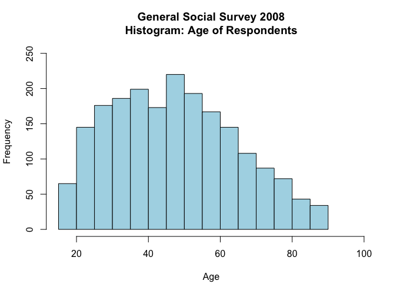
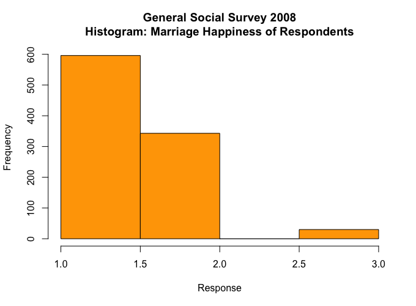
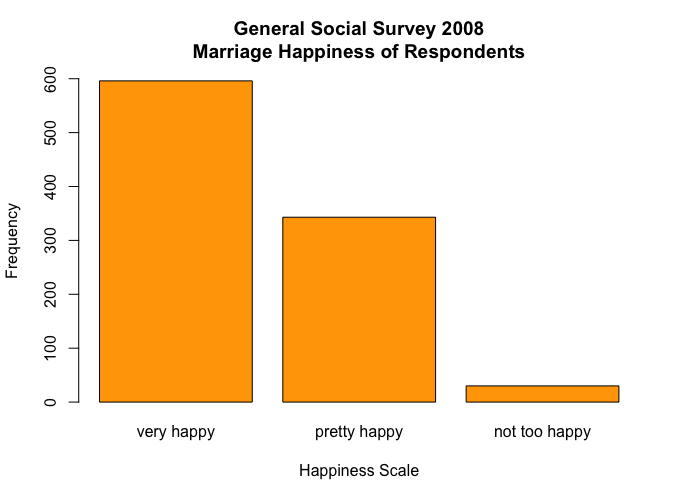
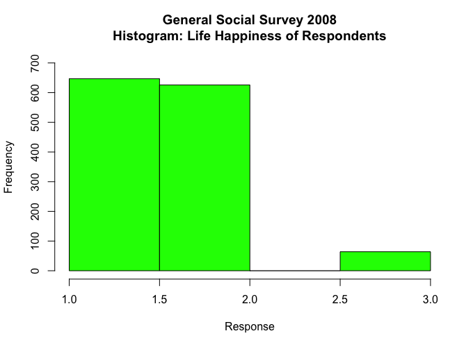
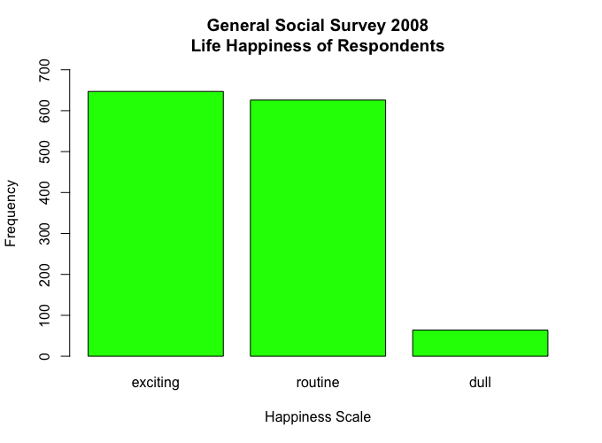

Michael Uftring   
Indiana University   
V506 - Statistical Analysis, Summer 2018   
Homework Exercise 1   

-----

# Analysis of General Social Survey 2008

## 1. import the General Social Survey 2008 data
(see script output)

## 2. Derive Basic Descriptive Statistics
- Find the mean, median, mode, range, variance, and standard deviation
- For variables: AGE, HRS1, TVHOURS, EDUC

(also see script output)

| Variable | mean     | median | mode | range (min-max) | variance | std.dev. |
| -------- | ----     | ------ | ---- | -----------------  | -------- | -------- |
| AGE      | 47.708   |   47   |  50  | 71 (18 - 89) | 301.052  | 17.351   |
| HRS1     | 42.003   |   40   |  40  | 88 (1 - 89)  | 209.667  | 14.480   |
| TVHOURS  |  2.982   |    2   |   2  | 24 (0 - 24)  |   7.071  |  2.659   |
| EDUC     | 13.432   |   13   |  12  | 20 (0 - 20)  |   9.480  |  3.079   |

## 3. generate histograms for the following: AGE, HAPMAR, LIFE

## 4. what does the histogram for AGE tell us? Is there anything distinctive about its shape?
The majority of people surveyed are aged 20-64. The shape of this histogram approximately follows a normal distribution.

## 5. what do you notice about the histograms for HAPMAR and LIFE?
The histograms for these categorical variables (variables stored as numbers) come out looking a little odd. The range of interesting values (excluding: missing, did not respond, etc.) is very small and so the histogram boxes did not always abut.

I provided bar plots of each of these, which afforded the ability to label the response values with their corresponding descriptions.

## 6. do people in the survey generally find their lives exciting, routine, or dull?
Most people surveyed find their lives exciting or routine (the frequency for each was almost the same), and a very small minority find their lives dull.

## 7. How do people describe their marriage?
Most people surveyed, who are married and provided an answer, are very happily married.

## 8. Approximately what percent of individuals in the sample are older than 75?
Estimating by looking at the histogram, it appears that between 5% and 10% are older than 75.
