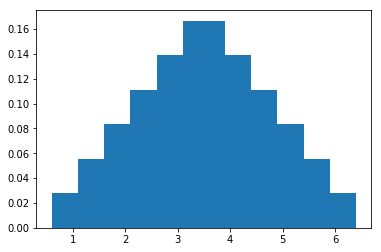
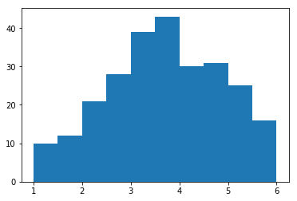
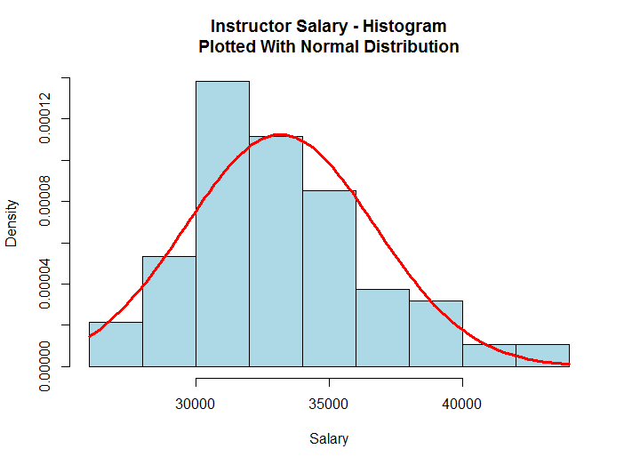

Michael Uftring
Indiana University
V506 - Statistical Analysis, Summer 2018
Homework Exercise 2

-----

# Questions

## 1. Basic Probability Rules.
A GSS estimates the probability than an American adult believes in heaven is 0.85.<p>
- *( a ) Estimate the probability that an American adult does not believe in heaven.*

Consider $A$ as the variable representing the condition: **an American adult believes in heaven**. We now can state that as a probability by $P(A) = 0.85$. And so the **probability that an American adult does not believe in heaven** is expressed as $P(not\:A) = 1 - P(A)$ = 1.0 - 0.85 = 0.15.

- *( b ) Of those who believe in heaven, about 84% believe in hell. Estimate the probability a randomly chosen adult believes in both heaven and hell.*

Let $A$ be the probability an American adult believes in heaven, which is $0.85$ or $85\%$.<p>
Let $B$ represent the 84% that believe in hell, given they believe in heaven.<p>
So, then $P(A \: and \: B) = P(A) \times P(B \: given \: A) = 0.85 \times 0.84 = 0.714$, or $71.4\%$.

## 2. Probability Distributions for Discrete and Continuous Variables.
Let y be the number of languages in which a person is fluent. According to Statistics Canada, for residents of Canada y has a probability distribution P(0) = 0.02, P(1) = 0.81, and P(2) = 0.17, with negligible probability for higher values of y.<p>
- *( a ) Is y a discrete, or a continuous variable? Why?*<p>

$y$ is a discrete variable because it is a count (number of items), which means the value can only be whole numbers (fractional values do not make sense).

- *( b ) Construct a table showing the probability distribution of y.*<p>

|  y  | P(y)  |
| --- | ----- |
|  0  | 0.02  |
|  1  | 0.81  |
|  2  | 0.17  |
| *Total*   | 1.0  |

- *( c ) Find the probability that a Canadian is not multilingual.*<p>

If $P(A)$ represents the probability that a Canadian is multilingual, then $P(not \: A)$ is the probability that a Canadian is not multilingual.

$P(not \: A) = 1 - P(A) = 1.0 - 0.17 = 0.83$

- *( d ) Find the mean of this probability distribution.*<p>

The mean of the probability distribution for a discrete variable is:<p>
$\mu = \sum yP(y)$<p>

For this probability distribution the mean equals: $0(0.02) + 1(0.81) + 2(0.17) = 1.15$

## 3. The Normal Probability Distribution.
For a study in Aarhus University Hospital (Denmark), 5459 pregnant women who reported information on length of gestation until birth had mean = 281.9 days and standard deviation = 11.4 days. A baby is classified as premature if the gestation time is 258 days or less.<p>
- *( a ) If gestation times are normally distributed, what proportion of babies would be born prematurely?*<p>

To figure this out we need to determine how many standard deviations 258 is away from 281.9. Given the number of standard deviations (the z-score) we can determine the desired proportion value.

The number of days between premature and the mean is: $258 - 281.9 = -23.9$, and the z-score is $-23.9 \div 11.4 \approx -2.1$, meaning that 258 falls 2.1 standard deviations below the mean. Consulting the z-score table, this indicates that the proportion is approximately $0.0179$.

- *( b ) The actual proportion born prematurely during the period was 0.036. Based on this information, how would you expect the distribution of gestation time to differ from the normal distribution?*<p>

With a normal distribution, 0.36 would have a z-score of 1.79. The difference in the computed and actual z-scores is approximately 0.31, which means the actual value is almost 1/3 of a standard deviation different from what is expected for a normal distribution. This suggests that the distribution would be skewed to the right from a normal distribution, and there are more premature births than expected given the mean and standard deviation computed in this sample.

## 4. Sampling Distribution of the Sample Mean.
The probability distribution associated with the outcome of rolling a balanced die has probability 1/6 attached to each integer, {1, 2, 3, 4, 5, 6}. Let (y1, y2) denote the outcomes for rolling the die twice.<p>

- *( a ) Enumerate the 36 possible (y1, y2) pairs (e.g., (2,1) represents a 2 followed by a 1).*

```
(1,1) (1,2) (1,3) (1,4) (1,5) (1,6)
(2,1) (2,2) (2,3) (2,4) (2,5) (2,6)
(3,1) (3,2) (3,3) (3,4) (3,5) (3,6)
(4,1) (4,2) (4,3) (4,4) (4,5) (4,6)
(5,1) (5,2) (5,3) (5,4) (5,5) (5,6)
(6,1) (6,2) (6,3) (6,4) (6,5) (6,6)
```

- *( b ) Treating the 36 pairs as equally likely, construct the sampling distribution for the sample mean y-bar of the two numbers rolled.*

I wrote a Python program that stores in a dictionary each of the 36 possible 2-die rolls identified in (a) above. Next, I used the `random.randint` function to generate a value between 1 and 36 to select a roll. The random selection of a roll was repeated 255 times. On each roll the sample mean was computed (add the two die values, and divide by two). The sample means were accumulated in another dictionary keyed by the sample mean (a value between 1.0 and 6.0).

| Die Roll Mean | Probability |
| --- | --- |
| 1.0 | 0.039 |
| 1.5 | 0.047 |
| 2.0 | 0.082 |
| 2.5 | 0.110 |
| 3.0 | 0.153 |
| 3.5 | 0.169 |
| 4.0 | 0.118 |
| 4.5 | 0.122 |
| 5.0 | 0.098 |
| 5.5 | 0.051 |
| 6.0 | 0.012 |
**Table 1: Sampling Distribution For the Sample Mean**<P>

- *( c ) Construct a histogram of the (i) probability distribution for each roll, (ii) sampling distribution of y-bar in ( b ). Describe their shapes.*


| Die Roll Mean | Frequency   | Probability |
| ------------- | ----------- | ----------- |
| 1.0 | 1 | 0.03 |
| 1.5 | 2 | 0.06 |
| 2.0 | 3 | 0.08 |
| 2.5 | 4 | 0.11 |
| 3.0 | 5 | 0.14 |
| 3.5 | 6 | 0.17 |
| 4.0 | 5 | 0.14 |
| 4.5 | 4 | 0.11 |
| 5.0 | 3 | 0.08 |
| 5.5 | 2 | 0.06 |
| 6.0 | 1 | 0.03 |
**Table 2: Frequency and Probability Distribution for 2-die Roll**<P>

<p>
**Figure 1: 2-die Roll Probability Distribution Histogram**<P>

<p>
**Figure 2: 2-die Roll Sampling Distribution of $\bar{y}$ Histogram**<P>

- *( d ) What are the means of the two distributions in ( c )? Why are they the same?*

The mean of the Probability Distribution is 3.5.<P>
The mean of the Sampling Distribution is 3.4568.<P>

The means are approximately the same because the sampling distribution of the sample mean will approximate the mean of the actual probability distribution as the number of samples increases (towards infinity).

- *( e ) Explain why the sampling distribution of y-bar has relatively more probability near the middle than at the minimum and maximum values. (Hint: Note there are many more (y1, y2) pairs that have a sample mean near the middle than near the minimum or maximum.)*

The sampling distribution of $\bar{y}$ is essentially accumulating mean values. As such, and as the hint indicates, there will be many more values near the actual mean value than out towards the tails. This is because the sampling distribution finds the mean of the values in each sample, which will over time tend to center on the actual mean.

## 5. Point and Interval Estimates.
One question on a recent General Social Survey asked, “Do you think that it should be government’s responsibility to reduce income differences between the rich and the poor?” Those answering yes included 90 out of the 142 subjects who called themselves strong Democrats in political party identification and 26 of the 102 who called themselves strong Republicans.<P>
- *( a ) Find the point estimate of the population proportion who would answer yes for each group.*

The point estimate for strong Democrats is 0.634
The point estimate for strong Republicans is 0.255

- *( b ) The 95% confidence interval for the population proportion of yes responses is (0.55, 0.71) for strong Democrats and (0.17, 0.34) for strong Republicans. Explain how to interpret the intervals.*

The intervals are intended to give a value range within which the parameter value is expected to be. In this case, the strong Democrat interval is +/-0.08 from its point estimate, and the strong Republican interval is +/-0.085 from its point interval. These +/- values are the margin of error and intend to provide some insight into the precision of the point estimate.

## 6. Confidence Interval for a Proportion.
When the GSS most recently asked whether human beings developed from earlier species of animals, 53.8% of 1095 respondents answered that this was probably or definitely not true.<P>

*Find a 99% confidence interval for the corresponding population proportion, and indicate whether you can conclude that a majority of Americans felt this way.*<P>

$$se = \sqrt{\frac{\hat{\pi}(1-\hat{\pi})}{n}} = \sqrt{\frac{(0.538)(0.462)}{1095}} = \sqrt{0.0002} = 0.015$$

A 99% confidence interval for $\pi$ is

$$\hat{\pi} \pm 2.58(se) = 0.538 \pm 2.58(0.015) = 0.538 \pm 0.0387, \: or \:(0.4993, 0.5767)$$

We can therefore conclude that at least very close to half, 49.93%, but no more than 57.67% believe human beings probably or definitely did not develop from earlier species of animals.

## 7. Confidence Interval for a Mean.
In response to the GSS question in 2014 about the number of hours daily spent watching TV, the responses by the seven subjects who identified themselves as being raised Islamic were 1, 1, 1, 2, 2, 3, 6.<P>

- *( a ) Estimate the mean, standard deviation, and standard error.*

$se = s / \sqrt{n}$

```
data:     [1, 1, 1, 2, 2, 3, 6]
n:        7
Mean:     2.286
StDev:    1.799
SE Mean:  0.68
```

- *( b ) Construct a 95% confidence interval for the population mean, specifying its assumptions. Interpret.*

A 95% Confidence Interval for a Mean is:

$\bar{y} \pm t_{.025}(se)$, with $se = s / \sqrt{n}$, where $df = n-1$ for the t-score.

In this case $df = 7-1 = 6$.

$\bar{y} \pm t_{.025}(se)$
$\bar{y} \pm t_{.025}(s / \sqrt{n})$
$2.286 \pm 2.447(1.799/\sqrt{7})$
$2.286 \pm 1.664$
(0.622, 3.95)

The 95% confidence interval has a broad range. The low end is 0.622 and the high end is 3.95, with a point estimate of approximately $2\frac{1}{4}$. The wide range, even with high confidence interval value, is likely due to the small sample size. The standard deviation value is close to the mean, which generally indicates a skew in the distribution; in this case, where negative values do not make sense, we can conclude that the distribution is skewed to the right. Looking closer at the data we observe that the median is 2 and the mode is 1. We also observe a single value of 6, which could be considered an outlier and be the cause for large standard deviation and thus such a wide range in the confidence interval.

## 8. Choice of Sample Size.
A 2011 poll in Canada indicated that 41% of Canadians favored bringing back the death penalty for convicted murderers. (The United States is the only Western democracy that has it.). A report by Amnesty International on this and related polls (www.amnesty.ca) did not report the sample size but states, “Polls of this size are considered to be accurate within 2.5 percentage points 95% of the time.”

*If this is the case, about how large was the sample size?*

The margin of error is 2.5%.
The probability with which the margin of error is to be achieved is 0.95.
Objective: determine the sample size $n$ such that a 95% confidence interval for $\pi$ equals $\hat{\pi} \pm 0.025$.

$\hat{\pi}$ falls within 1.96 standard errors of $\pi$ with probability 0.95.

$0.025 = 1.96\sqrt{\frac{\pi(1-\pi)}{n}}$
...
$n = \frac{(1.96)^{2}\pi(1-\pi)}{(0.025)^{2}}$
in this case, $\pi = 0.41$, so
$n = \frac{(1.96)^{2}(0.41)(1-0.41)}{(0.025)^{2}} = 1486.85$

In this case, the sample size was approximately 1487.

## 9. The Five Parts of a Significance Test.
You want to know whether adults in your country think the ideal number of children is equal to 2, or higher or lower than that.<p>
- *( a ) Define notation and state the null and alternative hypotheses for studying this.*

Let $\mu$ denote the ideal number of children.
The *null hypothesis* claim is that the ideal number of children is 2, thus ${H_0}: \mu = 2.0$.
The *alternative hypothesis* is that the ideal number of children is not 2, and so $H_{a}: \mu \ne 2.0$

- *( b ) For responses in a recent GSS to the question “What do you think is the ideal number of children to have?” software shows results:*

Test of mu = 2.0 vs mu not = 2.0
| Variable |	n   | Mean	| StDev	| SE Mean	|  T    | P-value |
| -------- | ---- | ----- | ----- | ------- | ----- | ------- |
| Children | 1302 | 2.490	| 0.850	| 0.0236	| 20.80	| 0.0000  |

*Report the test statistic value, and show how it was obtained from other values reported in the table.*

The test statistic is number of children and the T value here is 20.80, reporting the number of standard errors away the value in the null hypothesis is from the mean of the observed data. Its value is derived by computing the difference between the $\mu$ value in the null hypotheses and the mean in the observed data, and dividing by the standard error.

$se = s / \sqrt{n} = 0.023556644807631963$
$0.490 / 0.023556644807631963 = 20.8$

- *( c ) Explain what the P-value represents, and interpret its value.*

The P-value is a probability indicator of whether the observed data support or reject the null hypothesis. The larger the value, the more likely it is that the observed data would not be unusual given the null hypothesis is true. The smaller the value, the less evidence there is to support the null hypothesis. In this case the P-value is 0.0000, which is indeed "very small" (a value of 0.01 is sufficient to debunk a null hypothesis), and so we may conclude that the alternative hypothesis is more likely.

## 10. Significance Test for a Mean.
By law, an industrial plant can discharge no more than 500 gallons of waste water per hour, on the average, into a neighboring lake. Based on other infractions they have noticed, an environmental action group believes this limit is being exceeded. Monitoring the plan is expensive, and a random sample of four hours is selected over a period of a week. Software reports

| Variable	| No. Cases	  | Mean		| StDev		  | SE of Mean |
| --------- | ----------- | ------- | --------- | ---------- |
| WASTE     | 4           | 1000.0  | 400.0     | 200.0      |

> **Note**:
> - The null hypothesis: the waste discharge is 500 gallons per hour, $H_{0}: \mu = 500$
> - the alternative hypothesis: the waste discharge is much greater than 500 gallons per hour, $H_{a}: \mu > 500$

- *( a ) Test whether the mean discharge equals 500 gallons per hour against the alternative that the limit is being exceeded. Find the P-value, and interpret.*

$se = s / \sqrt{n}$
$t = \frac{\bar{y} - \mu_{0}}{se}$
$t = \frac{1000 - 500}{200.0} = 2.5$
Consulting Table B, with $df = 3$, the one-tail P-value will be between 0.025 and 0.050.

With a P-value in this range we can reject the null hypothesis (outright). The general convention is that when $P \le 0.05$ the null hypotheses can be rejected.

- *( b ) Explain why the test may be highly approximate or even invalid if the population distribution of discharge is far from normal.*

The small sample size and large standard deviation introduce some doubt, and suggest this test could be highly approximate.

- *( c ) Explain how your one-sided analysis implicitly tests the broader null hypothesis that μ <= 500.*

In the original $H_{0}$ we are testing the distance from $\mu = 500$, and are able to conclude that we can reject that null hypothesis. If $\mu$ were smaller in $H_{0}$, that is less than 500, we would be testing the same observed values against a distance already further away and could thus reach the same conclusion.

## 11. Significance Test for a Proportion.
Same-sex marriage was legalized across Canada by the Civil Marriage Act enacted in 2005. Is this supported by a majority, or a minority, of the Canadian population? In an Ipsos Global poll conducted for Reuter News in May 2013 of 1000 Canadians that asked whether legalization should stand or be repealed, 63% supported legalization. Let π denote the population proportion of Canadian adults who support legalization. For testing $H_{0}: \mu = 0.50$ against, $H_{a}: \mu \ne  0.50$<P>

| Variable | n       | $\pi$  |
| -------- | ------- | ------ |
| SUPPORT  | 1000    | 0.63   |

- *( a ) Find the standard error, and interpret.*

$se_{0} = \sqrt{\frac{\pi_{0}(1 - \pi_{0})}{n}}$
$ = \sqrt{\frac{(0.50)(1-0.50)}{1000}}$
$ = 0.0158$

The standard error here is rather small, which indicates that the sample size is sufficient for an accurate standard deviation of the mean..

- *( b ) Find the test statistic, and interpret.*
> This measures the number of standard errors that the sample proportion $\hat{\pi}$ falls from $\pi_{0}$

$z = \frac{\hat{\pi} - \pi_{0}}{se_{0}}$
$ = \frac{0.63 - 0.50}{0.0158}$
$ = 8.228$

The sample proportion falls a large number of standard errors away from the the $H_{0}$ value.

- *( c ) Find the P-value, and interpret in context.*
> The P-value for a test statistic measures the number of standard errors a point estimate falls from a $H_{0}$ value.

Since $H_{a}: \pi \ne \pi_{0}$, the P-value will be a two-tail probability. This result will be double the single-tail probability beyond the observed z-value.

$z = 0.823$
From Table A, the greatest right-hand tail probability is for a z-score of 5.0 =  $0.000000287$
$2(0.000000287) = 0.000000547$

This is an incredibly tiny P-value, so we can definitely conclude that the null hypothesis is rejected. The poll of 1000 Canadians is sufficient, and the results are conclusive: a majority of Canadians support same-sex marriage.

## 12. Decisions and Types of Errors in Tests.
Example 6.4 (page 148 in the 5th edition and page 151 in the 4th edition) tested a therapy for anorexia, using Ho: μ = 0 and Ha: μ  0 about the population mean weight change.

>$\mu$ denotes the population mean change in weight for the cognitive behavioral treatment
if this treatment has beneficial effect, as expected, then $\mu$ is positive
to test for no treatment effect versus a positive mean weight change, we test
$H_{0}: \mu = 0$
$H_{a}: \mu > 0$

- *( a ) In the words of that example, what is (i) Type I error? (ii) Type II error?*
>When $H_{0}$ is *true*, a Type I error occurs if $H_{0}$ is rejected
When $H_{0}$ is *false*, a Type II error occurs if $H_{0}$ is not rejected

In this study:
A Type I error would occur if there truly was no effect from the treatment and that hypothesis was rejected.
A Type II error would occur if there was a beneficial effect from the treatment and the null hypothesis (there is no effect from the treatment) was not rejected.

- *( b ) The P-value was 0.018 (5th edition) or 0.017 (4th edition). If the decision for α = 0.05 were in error, what type of error is it?*

a Type I error

- *( c ) Suppose instead α = 0.01. What decision would you make? If it is in error, what type of error is it?*

In this case, with $\alpha = 0.01$ the decision for a P-value of $0.017$ (I'm working with the 4th edition) would be to not reject $H{0}$ but also to not accept $H_{a}$. Given that we believe $H_{0}$ is false, this would be a Type II error.

## 13. Limitations of Significance Tests.
A report by the Collaborative on Academic Careers in Higher Education indicated that there is a notable gap between female and male academics in their confidence that tenure rules are clear, with men feeling more confident. The 4500 faculty members in the survey were asked to evaluate policies on a scale of 1 to 5 (very unclear to very clear). The mean response about the criteria for tenure was 3.51 for females and 3.55 for males, which was indicated to meet the test for statistical significance.

*Use this study to explain the distinction between statistical significance and practical significance.*

> “When the null hypothesis is rejected, the effect is said to be statistically significant.”
“Thus, finding that an effect is statistically significant signifies that the effect is real and not due to chance.”
“it does not mean that the effect is important, which is what “significant” usually means.”

Excerpts From: David M. Lane. “Introduction to Statistics: An Interactive e-Book.” David Lane, 2013. iBooks. https://itunes.apple.com/us/book/introduction-to-statistics-an-interactive-e-book/id684001500?mt=11

The results concluded that there was statistical significance in this test, further meaning that the null hypothesis was rejected. It would be noted that there was a notable gap in confidence of clarity of tenure rules between female and male academics.

If we just look at the mean responses -- female = 3.51, male = 3.55 -- we might conclude on our own that they are nearly identical. The gap between them is only 0.04. How would we quantify, in words, that amount of difference? We might simply conclude that the results were practically the same and there was not a notable gap.
# Analysis

## 1. Ohio School Districts
Using the SCHOOLS.CSV data set which contains data on a sample of school districts in Ohio.

- ( a ) Find the mean, median, mode, range, variance, and standard deviation for the variables: Number of Students (Students), the Percent of Families Receiving Welfare (Welfare), the Amount Spent per Pupil (Instruct), and Average Instructor Salary (Salary).<p>

```
> library(readr)
> library(DescTools)
> library(car)
> compute.stats <- function(n, l, v) {
+   v.mean = mean(v, na.rm=T)
+   v.median = median(v, na.rm=T)
+   v.mode = Mode(v, na.rm=T)[1]
+   v.result <- range(v, na.rm=T)
+   v.min <-v.result[1]
+   v.max <- v.result[2]
+   v.range <- v.max - v.min
+   v.var = var(v, na.rm=T)
+   v.sd = sd(v, na.rm=T)
+   print(sprintf("variable: %s mean: %.3f median: %.3f mode = %.3f range: %.3f (%.3f - %.3f) variance: %.3f stddev: %.3f",
+                 n, v.mean, v.median, v.mode, v.range, v.min, v.max, v.var, v.sd))
+   return(list(n, v.mean, v.median, v.mode, v.min, v.max, v.range, v.var, v.sd))
+ }
> SCHOOLS <- read_csv("SCHOOLS.csv")
Parsed with column specification:
cols(
  Schools = col_character(),
  Students = col_integer(),
  Income = col_integer(),
  Property = col_integer(),
  Welfare = col_double(),
  Salary = col_integer(),
  Instruct = col_integer(),
  Attend = col_double(),
  Passing = col_integer()
)
> # create summary table
> df = data.frame(Variable=character(), Mean=double(), Median=double(), Mode=double(), Min=double(), Max=double(), Range=double(), Variance=double(), StdDev=double(), stringsAsFactors=FALSE)
> # find mean, median, mode, range, variance, and standard deviation for...
> df[nrow(df) + 1,] = compute.stats("Students","Number of Students", SCHOOLS$Students)
[1] "variable: Students mean: 2134.053 median: 1226.500 mode = 20.000 range: 36770.000 (20.000 - 36790.000) variance: 15171368.610 stddev: 3895.044"
> df[nrow(df) + 1,] = compute.stats("Welfare","Percent of Families Receiving Welfare", SCHOOLS$Welfare)
[1] "variable: Welfare mean: 7.233 median: 5.350 mode = 3.900 range: 42.600 (0.200 - 42.800) variance: 42.540 stddev: 6.522"
> df[nrow(df) + 1,] = compute.stats("Instruct","Amount Spent per Pupil", SCHOOLS$Instruct)
[1] "variable: Instruct mean: 2724.606 median: 2508.500 mode = 2250.000 range: 9310.000 (1916.000 - 11226.000) variance: 1199502.284 stddev: 1095.218"
> df[nrow(df) + 1,] = compute.stats("Salary","Average Instructor Salary", SCHOOLS$Salary)
[1] "variable: Salary mean: 33181.404 median: 32708.000 mode = 26125.000 range: 17131.000 (26125.000 - 43256.000) variance: 12591883.276 stddev: 3548.504"
> # show the summary table
> print(df)
  Variable         Mean   Median    Mode     Min     Max   Range     Variance      StdDev
1 Students  2134.053191  1226.50    20.0    20.0 36790.0 36770.0 1.517137e+07 3895.044109
2  Welfare     7.232979     5.35     3.9     0.2    42.8    42.6 4.253987e+01    6.522259
3 Instruct  2724.606383  2508.50  2250.0  1916.0 11226.0  9310.0 1.199502e+06 1095.217916
4   Salary 33181.404255 32708.00 26125.0 26125.0 43256.0 17131.0 1.259188e+07 3548.504372
```

|Variable|Mean|Median|Mode|Min|Max|Range|Variance|StdDev|
| ------ | -- | -----|----|---|---|-----|--------|------|
|Students|2134.053191|1226.50|20.0|20.0|36790.0|36770.0|1.517137e+07|3895.044109|
|Welfare|7.232979|5.35|3.9|0.2|42.8|42.6|4.253987e+01|6.522259|
|Instruct|2724.606383|2508.50|2250.0|1916.0|11226.0|9310.0|1.199502e+06|1095.217916|
|Salary|33181.404255|32708.00|26125.0|26125.0|43256.0|17131.0|1.259188e+07|3548.504372|

- ( b ) Create a new variable called “AmtPerPupil_StdScore” which is equal to the Amount Spent per Pupil (Instruct) converted to standard scores (i.e., z-scores) and print out the original and new variable values.  Then interpret the highest and lowest values for the Amt_Per_Pupil_Std_Score.<P>

```
> # compute the z-score for each value of Instruct
> ## find the number of samples
> samples <- length(SCHOOLS$Instruct)
> ## create new column in SCHOOLS to hold Amount sSpent per Pupil Standard Score
> SCHOOLS$AmtPerPupil_StdScore <- double(samples)
> ## function to compute z-score
> compute.zscore <- function(yi, ybar, s) {
+   z <- (yi - ybar)/s
+   return(z)
+ }
> ## get the mean and standard deviation from the summary table (data frame)
> ybar <- df[df$Variable == "Instruct","Mean"]
> s <- df[df$Variable == "Instruct","StdDev"]
> ## compute the z-scores
> z <- double(samples)
> for (i in 1:samples) {
+   yi = SCHOOLS$Instruct[i]
+   z[i] = compute.zscore(yi, ybar, s)
+   print(sprintf("Observation: %d Value: %.3f Z-score: %.3f",i , yi, z[i]))
+ }
[1] "Observation: 1 Value: 2130.000 Z-score: -0.543"
[1] "Observation: 2 Value: 2570.000 Z-score: -0.141"
[1] "Observation: 3 Value: 2262.000 Z-score: -0.422"
[1] "Observation: 4 Value: 2506.000 Z-score: -0.200"
[1] "Observation: 5 Value: 2250.000 Z-score: -0.433"
[1] "Observation: 6 Value: 2657.000 Z-score: -0.062"
[1] "Observation: 7 Value: 2431.000 Z-score: -0.268"
[1] "Observation: 8 Value: 2693.000 Z-score: -0.029"
[1] "Observation: 9 Value: 2438.000 Z-score: -0.262"
[1] "Observation: 10 Value: 2351.000 Z-score: -0.341"
[1] "Observation: 11 Value: 2496.000 Z-score: -0.209"
[1] "Observation: 12 Value: 2564.000 Z-score: -0.147"
[1] "Observation: 13 Value: 2861.000 Z-score: 0.125"
[1] "Observation: 14 Value: 2968.000 Z-score: 0.222"
[1] "Observation: 15 Value: 2464.000 Z-score: -0.238"
[1] "Observation: 16 Value: 2766.000 Z-score: 0.038"
[1] "Observation: 17 Value: 11226.000 Z-score: 7.762"
[1] "Observation: 18 Value: 2834.000 Z-score: 0.100"
[1] "Observation: 19 Value: 2252.000 Z-score: -0.432"
[1] "Observation: 20 Value: 2250.000 Z-score: -0.433"
[1] "Observation: 21 Value: 2837.000 Z-score: 0.103"
[1] "Observation: 22 Value: 2309.000 Z-score: -0.379"
[1] "Observation: 23 Value: 2492.000 Z-score: -0.212"
[1] "Observation: 24 Value: 2615.000 Z-score: -0.100"
[1] "Observation: 25 Value: 2205.000 Z-score: -0.474"
[1] "Observation: 26 Value: 2420.000 Z-score: -0.278"
[1] "Observation: 27 Value: 2063.000 Z-score: -0.604"
[1] "Observation: 28 Value: 2584.000 Z-score: -0.128"
[1] "Observation: 29 Value: 2416.000 Z-score: -0.282"
[1] "Observation: 30 Value: 2752.000 Z-score: 0.025"
[1] "Observation: 31 Value: 2321.000 Z-score: -0.369"
[1] "Observation: 32 Value: 2860.000 Z-score: 0.124"
[1] "Observation: 33 Value: 2380.000 Z-score: -0.315"
[1] "Observation: 34 Value: 2512.000 Z-score: -0.194"
[1] "Observation: 35 Value: 2431.000 Z-score: -0.268"
[1] "Observation: 36 Value: 2552.000 Z-score: -0.158"
[1] "Observation: 37 Value: 2422.000 Z-score: -0.276"
[1] "Observation: 38 Value: 2454.000 Z-score: -0.247"
[1] "Observation: 39 Value: 2474.000 Z-score: -0.229"
[1] "Observation: 40 Value: 2374.000 Z-score: -0.320"
[1] "Observation: 41 Value: 2347.000 Z-score: -0.345"
[1] "Observation: 42 Value: 2384.000 Z-score: -0.311"
[1] "Observation: 43 Value: 4150.000 Z-score: 1.301"
[1] "Observation: 44 Value: 2844.000 Z-score: 0.109"
[1] "Observation: 45 Value: 2943.000 Z-score: 0.199"
[1] "Observation: 46 Value: 3933.000 Z-score: 1.103"
[1] "Observation: 47 Value: 2941.000 Z-score: 0.198"
[1] "Observation: 48 Value: 2997.000 Z-score: 0.249"
[1] "Observation: 49 Value: 2774.000 Z-score: 0.045"
[1] "Observation: 50 Value: 2611.000 Z-score: -0.104"
[1] "Observation: 51 Value: 3444.000 Z-score: 0.657"
[1] "Observation: 52 Value: 3158.000 Z-score: 0.396"
[1] "Observation: 53 Value: 2845.000 Z-score: 0.110"
[1] "Observation: 54 Value: 2926.000 Z-score: 0.184"
[1] "Observation: 55 Value: 7824.000 Z-score: 4.656"
[1] "Observation: 56 Value: 2560.000 Z-score: -0.150"
[1] "Observation: 57 Value: 2588.000 Z-score: -0.125"
[1] "Observation: 58 Value: 2174.000 Z-score: -0.503"
[1] "Observation: 59 Value: 2274.000 Z-score: -0.411"
[1] "Observation: 60 Value: 2225.000 Z-score: -0.456"
[1] "Observation: 61 Value: 2154.000 Z-score: -0.521"
[1] "Observation: 62 Value: 2078.000 Z-score: -0.590"
[1] "Observation: 63 Value: 2811.000 Z-score: 0.079"
[1] "Observation: 64 Value: 2242.000 Z-score: -0.441"
[1] "Observation: 65 Value: 2306.000 Z-score: -0.382"
[1] "Observation: 66 Value: 2616.000 Z-score: -0.099"
[1] "Observation: 67 Value: 2227.000 Z-score: -0.454"
[1] "Observation: 68 Value: 2383.000 Z-score: -0.312"
[1] "Observation: 69 Value: 2394.000 Z-score: -0.302"
[1] "Observation: 70 Value: 2435.000 Z-score: -0.264"
[1] "Observation: 71 Value: 2743.000 Z-score: 0.017"
[1] "Observation: 72 Value: 2564.000 Z-score: -0.147"
[1] "Observation: 73 Value: 2501.000 Z-score: -0.204"
[1] "Observation: 74 Value: 2506.000 Z-score: -0.200"
[1] "Observation: 75 Value: 2455.000 Z-score: -0.246"
[1] "Observation: 76 Value: 2511.000 Z-score: -0.195"
[1] "Observation: 77 Value: 1916.000 Z-score: -0.738"
[1] "Observation: 78 Value: 2382.000 Z-score: -0.313"
[1] "Observation: 79 Value: 2706.000 Z-score: -0.017"
[1] "Observation: 80 Value: 2349.000 Z-score: -0.343"
[1] "Observation: 81 Value: 2654.000 Z-score: -0.064"
[1] "Observation: 82 Value: 2470.000 Z-score: -0.232"
[1] "Observation: 83 Value: 2617.000 Z-score: -0.098"
[1] "Observation: 84 Value: 3011.000 Z-score: 0.261"
[1] "Observation: 85 Value: 2643.000 Z-score: -0.075"
[1] "Observation: 86 Value: 2849.000 Z-score: 0.114"
[1] "Observation: 87 Value: 2539.000 Z-score: -0.169"
[1] "Observation: 88 Value: 2979.000 Z-score: 0.232"
[1] "Observation: 89 Value: 2499.000 Z-score: -0.206"
[1] "Observation: 90 Value: 2820.000 Z-score: 0.087"
[1] "Observation: 91 Value: 3258.000 Z-score: 0.487"
[1] "Observation: 92 Value: 2331.000 Z-score: -0.359"
[1] "Observation: 93 Value: 2267.000 Z-score: -0.418"
[1] "Observation: 94 Value: 2513.000 Z-score: -0.193"
> ## Store the z-scores in the table
> SCHOOLS$AmtPerPupil_StdScore <- z
> ## find the highest and lowest z-score values
> a = integer(samples)
> for (i in 1:samples) {a[i]=i}
> df2 = data.frame(Index=a, School=SCHOOLS$Schools, Value=SCHOOLS$Instruct, Score=SCHOOLS$AmtPerPupil_StdScore)
> print("The Maximum z-score:")
[1] "The Maximum z-score:"
> df2[which.max(df2$Score),]
   Index         School Value    Score
17    17 Kelleys Island 11226 7.762285
> print("The Minimum z-score:")
[1] "The Minimum z-score:"
> df2[which.min(df2$Score),]
   Index         School Value      Score
77    77 Edon-Northwest  1916 -0.7383064
```

The lowest z-score is $-0.7383064$ for the Edon-Northwest schools. This represents a value that is 0.7 standard deviations below the mean value. The highest z-score of $7.762285$ belongs to the Kelleys Island schools and represents a value much higher than the mean. The Kelleys Island score is 7.7 standard deviations greater than the mean, and is clearly an outlier.

- ( c ) Create a plot where you overlay the normal curve on a histogram for average instructor salary (hint: to do this, you will need to use the curve and dnorm functions in R as demonstrated in the tutorial video). Be sure to add appropriate label axes and other elements necessary to enhance the readability of your graph. After constructing your plot, discuss any similarities or differences you observe between the observed distribution for instructor salary and the normal distribution.<p>

```
> # plot histogram of Salary with normal distribution overlay
> hist(SCHOOLS$Salary, prob=T, main="Instructor Salary - Histogram\nPlotted With Normal Distribution", xlab = "Salary", col="lightblue")
> curve(dnorm(x, mean(SCHOOLS$Salary, na.rm=T), sd(SCHOOLS$Salary, na.rm=T)), add=T, lwd=3, col="red")
```

<p>
**Figure 3: Ohio School Disctricts - Instructor Salaries**<P>

The distribution for the instructor salaries in the Ohiio School disctricts has a bell-shaped curve, but with a definite skew to the right. We can see that the peak of the actual salary distribution is to the left of the peak of the normal distribution with the same parameters (mean, standard deviation). This would indicate that there are some instructors with very high salaries well above the mean and many instructors with salaries below the mean.

## 2. Baltimore Longitudinal Study of Aging
This data set is named:  BLSA.csv, which is a text file available from Canvas. The variables in this data set are, in order, subject number, sex, age, smoker, systolic blood pressure (SBP), diastolic blood pressure (DBP), height, and weight for a random sample of 720 adults. Ages are given in years, blood pressure readings are in millimeters of mercury, heights are given in centimeters, and weights are given in kilograms. Male gender is indicated with a value of M and female gender with a value of F. A smoker is given a value of Y and a non-smoker a value of N.

- ( a ) Construct a 95% confidence interval for the mean diastolic blood pressure of all males. Interpret the results.<p>
- ( b ) Construct a 99% confidence interval for the proportion of males that smoke. Interpret the results.<p>
- ( c ) Construct a 90% confidence interval for the mean systolic blood pressure of all females who are over 30 years old. Interpret the results.<p>
- ( d ) Test the claim, at the .05 level of significance, that males who are 50 and older have a mean systolic blood pressure that is greater than the mean systolic blood pressure for all men. Use the p-value method.<p>
- ( e ) Test the claim, at the .01 level, that females who have lower weight than the mean weight of all females also have a lower mean systolic blood pressure than the average female. Use the p-value method.<p>

# Appendix

## Schools Analysis - R Script (source)


## Aging Study - R Script (source)
