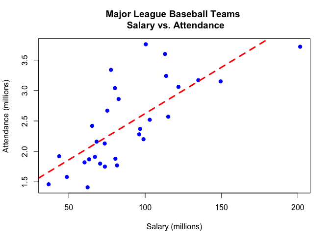

Michael Uftring
Indiana University
V506 - Statistical Analysis, Summer 2018
Homework Exercise 3

-----

# Part I - Bivariate Regression Analysis without R

## 9.3:
*Anthropologists often try to reconstruct information using partial human remains at burial sites. For instance, after finding a femur (thighbone), they may want to predict how tall an individual was. An equation they use to do this is:*

$\hat{y} = 61.4 + 2.4x$

*where $\hat{y}$ is the predicted height and $x$ is the length of the femur, both in centimeters.*

**(a)** *Identify the y-intercept and slope of the equation. Interpret the slope.*

The y-intercept is: 61.4
The slope is: 2.4

A one-unit increase in length of the femur is associated with a 2.4 unit increase in height, both units being centimeters.

**(b)** *A femur found at a particular site has length 50 cm. What is the predicted height of the person who had that femur?*

The prediction equation is: $\hat{y} = 61.4 + 2.4x$
We plug in 50 for $x$ to get: $\hat{y} = 61.4 + 2.4(50) = 181.4$

The predicted height for a human with a 50 cm femur is 181.4 cm.

## 9.58:
*The variables $y$ = annual income (thousands of dollars), $x_{1}$ = number of years of education, and $x_{2}$ = number of years experience in job are measured for all the employees having city-funded jobs, in Knoxville, Tennessee. The following prediction equations and correlations apply.*

(i.) $\hat{y} = 10 + 1.0x{_1}$, $r = 0.30$
(ii.) $\hat{y} = 14 + 0.4x_{2}$, $r = 0.60$

*The correlation is -0.40 between $x_{1}$ and $x_{2}$. Which of the following statements are true? (Hint: seven of the statements are true.)*

*If true, briefly explain why.*

> Variables:
> - $y$ = annual income (thousands of dollars)
> - $x_{1}$ = number of years of education
> - $x_{2}$ = number of years experience in job

**(a)** *The strongest sample association is between $y$ and $x_{2}$.*

True.

Of the three reported $r$ values, the largest absolute value is 0.60 which is the correlation value between $y$ and $x_{2}$.

**(b)** *The weakest sample association is between $x_{1}$ and $x_{2}$.*

False.

The smallest absolute value of the correlation is 0.30, the correlation value between $y$ and $x_{1}$.

**(c)** *The prediction equation using $x_{2}$ to predict $x_{1}$ has negative slope.*

True.

The slope and correlation have the same sign, and correlation between $x_{1}$ and $x_{2}$ is -0.40.

**(d)** *A standard deviation increase in education corresponds to a predicted increase of 0.3 standard deviations of income.*

True.

An increase of $s_{x}$ in $x$ corresponds to a predicted change of $r$ standard deviations in the $y$ values.

**(e)** *There is a 30% reduction in error in using education, instead of $\bar{y}$, to predict income.*

False.

The proportional reduction in error $= \frac{E_{1} - E_{2}}{E_{1}} = \frac{TSS-SSE}{TSS} = ... = r^{2}$
For education ($x_{1}$), $r = 0.30$, and $r^{2} = 0.09$, so the proportional reduction in error when using education, instead of $\bar{y}$, to predict income is 9%.

**(f)** *Each additional year on the job corresponds to a \$400 increase in predicted income.*

True.

The slope of the prediction formula for predicting annual income from experience is 0.4 and the units of $y$ are thousands of dollars. With a +1 increase to $x_{2}$ we can multiply the factors out: $0.4 \times 1 \times 1000 = \$400.$

**(g)** *When $x_{1}$ is the predictor of $y$, the sum of squared residuals (SSE) is larger than when $x_{2}$ is the predictor of $y$.*

True.

The better a prediction is, the smaller its SSE value. The larger $r^{2}$ is, the stronger the linear association, and thus there is a smaller SSE value.

$r^{2}_{x_{1}} = 0.30^{2} = 0.09$
$r^{2}_{x_{2}} = 0.60^{2} = 0.36$

Example:
If TSS = 1.0, then SSE would be approximately 0.91 to achieve an $r^{2} = 0.09$.
If TSS = 1.0, then SSE would be approximately 0.64 to achieve an $r^{2} = 0.36$.

**(h)** *The predicted mean income for employees having 20 years of experience is \$4000 higher than the predicted mean income for employees having 10 years of experience.*

True.

We can solve this by computing the predicted values of $\hat{y}$ for the two $x_{2}$ values, and then take the difference.

$\hat{y} = 14 + 0.4x_{2}$
when $x_{2} = 20$, $\hat{y} = 14 + 0.4(20) = 22.0$
when $x_{2} = 10$, $\hat{y} = 14 + 0.4(10) = 18.0$
$22.0 - 18.0 = 4.0$
The units of $y$ is annual income in thousands, so the result is \$4000.

**(i)** *If $s = 8$ for the model using $x_{1}$ to predict $y$, then it is not unusual to observe an income of \$70,000 for an employee who has 10 years of education.*

False.

**(j)** *It is possible that $s_{y} = 12.0$ and $s_{x_{1}} = 3.6$*

True.

In fact, with $s_{y} = 12.0$, $s_{x_{1}} = 3.6$, and $b = 1.0$ (as given in the problem statement), we compute $r = 0.30$.

$r = \left (\frac{s_{x_{1}}}{s_{y}} \right )b = \left (\frac{3.6}{12.0} \right )1.0 = 0.30$

**(k)** *It is possible that $\bar{y} = 20$ and $\bar{x_{1}} = 13.$*

False.

We can solve the prediction equation for either $x$ or $y$ given these values.

$\hat{y} = 10 + 1.0x{_1}$

$y = 10 + 1.0(13) = 23$
$x = (y - 10)/1.0 = (20 - 10) = 10$

Thus, when $y = 20$, then $x = 10$.
And, when $x = 13$, then $y = 23$.

## 9.61:
The slope of the least squares prediction equation and the correlation are similar in the sense that:

**(a)** They do not depend on the units.

False.

Slope is intrinsically linked to the units of measurement. Correlation does not depend on units.

**(b)** They both must fall between -1 and +1.

False.

Slope can take on any positive or negative real value. Correlation is bound within the range -1 to +1.

**(c)** They both have the same sign.

True.

A positive value for correlation indicates a positive linear relationship: as x increases, so does y. If x and y are increasing values with each other, then the slope of the line is a positive value.

**(d)** They both equal 1 when there is the strongest association.

False.

**(e)** Their squares both have proportional reduction in error interpretations.

False.

**(f)** They have the same $t$ statistic value for testing $H_{0}$: Independence.

True.

Recall that when slope = 0, correlation = 0, and they have the same direction indicator (sign). The test statistic for testing $H_{0}: \rho = 0$ (where $\rho$ is the correlation value for the population) produces the same value as the test statistic for slope: $t = \frac{b}{se}$.

**(g)** They both can be strongly affected by severe outliers.

True.

An outlier can have a significant effect because the underlying computations rely on the differences between observations and mean values. Outliers are far from all other values, and will skew the mean value and thus produce larger differences.

## 9.59:
One can interpret $r = 0.30$ as follows:

**(a)** A 30% reduction in error occurs in using $x$ to predict $y$.

False.

**(b)** A 9% reduction in error occurs in using $x$ to predict $y$ compared to using $\bar{y}$ to predict $y$.

True.

The proportional reduction in error $= \frac{E_{1} - E_{2}}{E_{1}} = \frac{TSS-SSE}{TSS} = ... = r^{2}$

$r^{2} = 0.30^{2} = 0.09$, thus there is a 9% reduction in error in using $x$ to predict $y$ compared to using $\bar{y}$ to predict $y$.

**(c)** 9% of the time $\hat{y} = y$.

True.

We can use $r^{2}$ to make claims like this based on the following:
- $r^{2}$ always falls between 0 and 1
- when $r^{2}$ is 1, SSE = 0, there is no prediction error, and all sample points fall exactly on the prediction line
- the opposite is true when $r^{2}$ is 0
- hence, we can posit that $r^{2}$ roughly represents the proportion of time that $\hat{y} = y$

**(d)** $y$ changes 0.30 units for every one-unit increase in $x$.

False.

**(e)** When $x$ predicts $y$, the average residual is 0.3.

False.

**(f)** $x$ changes exactly 0.30 standard deviations when $y$ changes one standard deviation.

False.


# Part II - Bivariate Regression with R

## Wooldridge GPA2 dataset
*One of the challenges that university administrators must deal with is deciding which students to admit to their institution, and which to deny. To help make these decisions, admissions officers often rely on quantitative data about student performance, such as scores on standardized tests like SAT exam.*

**a)** *Estimate a model where College GPA (colgpa) is the dependent variable, and scores on the SAT test (sat) is the independent variable. At the 0.01 level, can we conclude that students who score better on the SAT generally perform better in college?*

```
> library(readr)
> students <- read_csv("Wooldridge GPA2 Data Set.csv.xls")
Parsed with column specification:
cols(
  sat = col_integer(),
  tothrs = col_integer(),
  colgpa = col_double(),
  athlete = col_integer(),
  verbmath = col_double(),
  hsize = col_double(),
  hsrank = col_integer(),
  hsperc = col_double(),
  female = col_integer(),
  white = col_integer(),
  black = col_integer(),
  hsizesq = col_double()
)
> cor.test(students$sat, students$colgpa, conf.level = 0.99)

	Pearson's product-moment correlation

data:  students$sat and students$colgpa
t = 28.797, df = 4135, p-value < 2.2e-16
alternative hypothesis: true correlation is not equal to 0
99 percent confidence interval:
 0.3748055 0.4415272
sample estimates:
      cor
0.4087123
```

We run the **R** `cor.test` function to determine the correlation between SAT Scores and College GPAs. We see for correlation that $r = 0.4087123$ which indicates a positive linear relationship. This means that as SAT Scores increase, so do College GPAs. The P-value at the 0.01 level is extremely small (< 2.2e-16), indicating that the results are significant and we can reject any null hypothesis. Therefore we can conclude that students who score better on the SAT generally perform better in college.

## Real Estate dataset
**a)** *Let selling price be the dependent variable and size of the home the independent variable. Determine the regression equation. Estimate the selling price for a home with an area of 2,200 square feet.*

```
> library(readr)
> properties <- read_csv("REAL-ESTATE-2003.csv.xls")
Parsed with column specification:
cols(
  Price = col_double(),
  Bedrooms = col_integer(),
  Size = col_integer(),
  Pool = col_integer(),
  Distance = col_integer(),
  Twnship = col_integer(),
  Garage = col_integer(),
  Baths = col_double()
)
> yhat <- function(a, b, x) {
+   return (a+(b*x))
+ }
> lm(Price~Size, data=properties)

Call:
lm(formula = Price ~ Size, data = properties)

Coefficients:
(Intercept)         Size  
   64.79312      0.07029  

> model <- lm(Price~Size, data=properties)
> summary(model)

Call:
lm(formula = Price ~ Size, data = properties)

Residuals:
     Min       1Q   Median       3Q      Max
-107.587  -32.058   -5.829   33.000  113.900

Coefficients:
            Estimate Std. Error t value Pr(>|t|)    
(Intercept) 64.79312   38.78410   1.671   0.0978 .  
Size         0.07029    0.01733   4.055 9.76e-05 ***
---
Signif. codes:  0 ‘***’ 0.001 ‘**’ 0.01 ‘*’ 0.05 ‘.’ 0.1 ‘ ’ 1

Residual standard error: 43.95 on 103 degrees of freedom
Multiple R-squared:  0.1377,	Adjusted R-squared:  0.1293
F-statistic: 16.44 on 1 and 103 DF,  p-value: 9.756e-05

> a <- model$coefficients['(Intercept)']
> b <- model$coefficients['Size']
> yhat(a, b, 2200)
(Intercept)
   219.4293
```

The regression equation is:
$\hat{y} = 64.79312 + 0.07029x$

The estimated selling price for a home with an area of 2,200 square feet is:
$\hat{y} = 64.79312 + 0.07029 \times 2200 = 219.4293$ (thousands of dollars).

**b)** *Let selling price be the dependent variable and distance from the center of the city the independent variable. Determine the regression equation. Estimate the selling price of a home 20 miles from the center of the city.*

```
> lm(Price~Distance, data=properties)

Call:
lm(formula = Price ~ Distance, data = properties)

Coefficients:
(Intercept)     Distance  
    270.167       -3.354  

> model <- lm(Price~Distance, data=properties)
> summary(model)

Call:
lm(formula = Price ~ Distance, data = properties)

Residuals:
    Min      1Q  Median      3Q     Max
-84.795 -34.335  -2.989  25.865 108.067

Coefficients:
            Estimate Std. Error t value Pr(>|t|)    
(Intercept) 270.1670    13.7646  19.628  < 2e-16 ***
Distance     -3.3540     0.8931  -3.755 0.000287 ***
---
Signif. codes:  0 ‘***’ 0.001 ‘**’ 0.01 ‘*’ 0.05 ‘.’ 0.1 ‘ ’ 1

Residual standard error: 44.39 on 103 degrees of freedom
Multiple R-squared:  0.1204,	Adjusted R-squared:  0.1119
F-statistic:  14.1 on 1 and 103 DF,  p-value: 0.0002869

> a <- model$coefficients['(Intercept)']
> b <- model$coefficients['Distance']
> yhat(a, b, 20)
(Intercept)
   203.0871
```

The regression equation is:
$\hat{y} = 270.167 - 3.354x$

The estimated selling price of a home 20 miles from the center of the city is:
$\hat{y} = 270.167 - 3.354 \times 20 = 203.0871$ (thousands of dollars)

## 2009 Baseball dataset
**a)** *Let attendance be the dependent variable and total team salary be the independent variable (note, both variables are measured in millions). Construct a scatterplot of the two variables. From the diagram, does there seem to be a direct relationship between the two variables?*



Based on the scatterplot, there does appear to be a direct relationship between Salary and Attendance. We can see a positive linear relationship: as Salary increases, so does Attendance.

**b)** *Estimate a linear regression model for these variables, and interpret all of your results.*

```
> library(readr)
> baseball <- read_csv("2009Baseball.csv.xls")
Parsed with column specification:
cols(
  Team = col_character(),
  League = col_integer(),
  Built = col_integer(),
  Size = col_integer(),
  Salary = col_double(),
  Wins = col_integer(),
  Attendance = col_double(),
  BA = col_double(),
  ERA = col_double(),
  HR = col_integer(),
  Errors = col_integer(),
  SB = col_integer()
)
> yhat <- function(a, b, x) {
+   return (a+(b*x))
+ }
> cor.test(baseball$Salary, baseball$Attendance)

	Pearson's product-moment correlation

data:  baseball$Salary and baseball$Attendance
t = 5.7877, df = 28, p-value = 3.245e-06
alternative hypothesis: true correlation is not equal to 0
95 percent confidence interval:
 0.5145922 0.8676138
sample estimates:
      cor
0.7380357

> lm(Attendance~Salary, data=baseball)

Call:
lm(formula = Attendance ~ Salary, data = baseball)

Coefficients:
(Intercept)       Salary  
     1.1021       0.0152  

> model <- lm(Attendance~Salary, data=baseball)
> summary(model)

Call:
lm(formula = Attendance ~ Salary, data = baseball)

Residuals:
    Min      1Q  Median      3Q     Max
-0.6392 -0.2827 -0.1966  0.2823  1.1316

Coefficients:
            Estimate Std. Error t value Pr(>|t|)    
(Intercept) 1.102059   0.248432   4.436 0.000129 ***
Salary      0.015202   0.002627   5.788 3.25e-06 ***
---
Signif. codes:  0 ‘***’ 0.001 ‘**’ 0.01 ‘*’ 0.05 ‘.’ 0.1 ‘ ’ 1

Residual standard error: 0.4795 on 28 degrees of freedom
Multiple R-squared:  0.5447,	Adjusted R-squared:  0.5284
F-statistic:  33.5 on 1 and 28 DF,  p-value: 3.245e-06

> a <- model$coefficients['(Intercept)']
> b <- model$coefficients['Salary']
```

The regression equation is:
$\hat{y} = 1.1021 + 0.0152x$

As Salary increases by $1 million, Attendance increases by 0.015 million (15,000).

The correlation between Salary and Attendance is $r = 0.7380357$ which indicates a significant positive linear relationship between the two variables. With a P-value of 3.245e-06 we can safely say that these results are significant with 95% confidence.

**c)** *What is the expected attendance for a team with a salary of $80 million?*

```
> yhat(a, b, 80)
   2.318244
```

The expected attendance for a team with a salary of $80 million is 2.318244 million.

**d)** *If the owners pay an additional $30 million, how many more people could they expect to attend?*

Here we can use the `yhat` function, passing in $a = 0$ and $x = 30$ (million). This has the effect of measuring the rise in $y$ across a span where $x = 30$. We ignore the y-intercept because we are only interested in that rise over the span of the run.

```
> yhat(0, b, 30)
0.4560695
```

If the owners pay an additional $30 million, then can expect 0.4560695 million (approximately 456,000) more people to attend.


# Appendix

## R Source Files

### Wooldridge GPA2 dataset Analysis
```
# Michael Uftring
# Indiana University
# V506 - Statistical Analysis, Summer 2018
# Homework 3 : analysis of Students GPA and SAT scores
# --------------------------------------------------

library(readr)

students <- read_csv("Wooldridge GPA2 Data Set.csv.xls")
#View(students)

# a) Estimate a model where College GPA (colgpa) is the dependent variable,
# and scores on the SAT test (sat) is the independent variable. At the 0.01 level,
# can we conclude that students who score better on the SAT generally perform
# better in college?

cor.test(students$sat, students$colgpa, conf.level = 0.99)
```

### Real Estate dataset Analysis
```
# Michael Uftring
# Indiana University
# V506 - Statistical Analysis, Summer 2018
# Homework 3 : analysis of Real Estate data
# --------------------------------------------------

library(readr)

properties <- read_csv("REAL-ESTATE-2003.csv.xls")
#View(properties)

yhat <- function(a, b, x) {
  return (a+(b*x))
}

# (a) Let selling price be the dependent variable and size of the home the
# independent variable. Determine the regression equation. Estimate the
# selling price for a home with an area of 2,200 square feet.

lm(Price~Size, data=properties)

model <- lm(Price~Size, data=properties)
summary(model)

a <- model$coefficients['(Intercept)']
b <- model$coefficients['Size']

yhat(a, b, 2200)


# (b) Let selling price be the dependent variable and distance from the
# center of the city the independent variable. Determine the regression
# equation. Estimate the selling price of a home 20 miles from the center
# of the city.

lm(Price~Distance, data=properties)

model <- lm(Price~Distance, data=properties)
summary(model)

a <- model$coefficients['(Intercept)']
b <- model$coefficients['Distance']

yhat(a, b, 20)
```

### 2009 Baseball dataset Analysis
```
# Michael Uftring
# Indiana University
# V506 - Statistical Analysis, Summer 2018
# Homework 3 : analysis of Baseball data
# --------------------------------------------------

library(readr)

baseball <- read_csv("2009Baseball.csv.xls")
#View(baseball)

# (a) Let attendance be the dependent variable and total team salary be the
# independent variable (note, both variables are measured in millions).
# Construct a scatterplot of the two variables. From the diagram, does there
# seem to be a direct relationship between the two variables?

plot(baseball$Attendance~baseball$Salary,
     pch=19,
     col="blue",
     main = "Major League Baseball Teams \n Salary vs. Attendance",
     xlab = "Salary (millions)",
     ylab = "Attendance (millions)")
abline(lm(baseball$Attendance~baseball$Salary),col="red",lty=2,lwd=3)

# (b) Estimate a linear regression model for these variables, and interpret
# all of your results.

yhat <- function(a, b, x) {
  return (a+(b*x))
}

cor.test(baseball$Salary, baseball$Attendance)

lm(Attendance~Salary, data=baseball)
model <- lm(Attendance~Salary, data=baseball)

summary(model)

a <- model$coefficients['(Intercept)']
b <- model$coefficients['Salary']

# (c) What is the expected attendance for a team with a salary of $80 million?

yhat(a, b, 80)

# (d) If the owners pay an additional $30 million, how many more people could
# they expect to attend?

yhat(0, b, 30)
```
