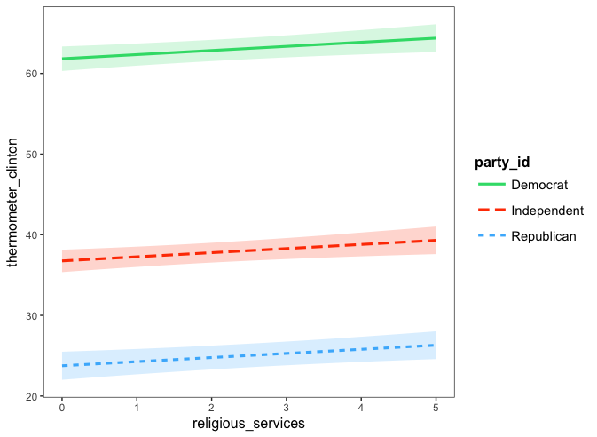

Michael Uftring
Indiana University
V506 - Statistical Analysis, Summer 2018
Homework Exercise 4

-----

# Part I: Multiple Regression (Textbook Problems)

## 11.2 (parts a, b, c, and d)
For recent data in Jacksonville, Florida
- $y$ = selling price of home (in dollars)
- $x_{1}$ = size of home (in square feet)
- $x_{2}$ = lot size (in square feet)

the prediction equation is:

$$\hat{y} = -10,536 + 53.8x_{1} + 2.84x_{2}$$

**(a)** *A particular home of 1240 square feet on a lot of 18,000 square feet sold for \$145,000. Find the predicted selling price and the residual, and interpret.*

The predicted selling price is:
$\hat{y} = -10,536 + 53.8(1240) + 2.84(18,000)$
$= 107296$

The residual is the observed value minus the predicted value:
$y - \hat{y}$
$= 145000 - 107296$
$= 37704$

The observed selling price is significantly higher than the predicted selling price. This could be for any of a number of reasons. The house may have above average amenities (appliances, fixtures, etc.). The higher sale price may also be due to location: being within a highly rated school district, or being in an otherwise very desirable neighborhood. Either of these location reasons would certainly be noted as justification for sale prices consistently higher than what the equation would predict. For greater accuracy in such cases, the house sale price prediction equation would likely benefit from having additional explanatory variables.

**(b)** *For fixed lot size, how much is the house selling price predicted to increase for each square-foot increase in home size? Why?*

With a fixed lot size, the house selling price is predicted to increase by \$53.8 for each square-foot increase in home size.

We can determine this by evaluating the prediction equation for a sample of home size values ($x_{1}$) while keeping the lot size ($x_{2}$) at a fixed value. We can plot this to observe the slope of the line. We can also determine the difference between two consecutive values of home size, which will represent the predicted increase in sale price per single unit of home size.

$\hat{y} = -10,536 + 53.8(1000) + 2.48(10,000) = 71664.00$
$\hat{y} = -10,536 + 53.8(1001) + 2.48(10,000) = 71717.80$
$71717.80 - 71664.00 = 53.80$

The value 53.8 also corresponds to the $\beta_{1}$ coefficient associated with the explanatory variable term $x_{1}$.

**(c)** *According to this prediction equation, for fixed home size, how much would lot size need to increase to have the same impact as a one square-foot increase in home size?*

With a fixed lot size, the predicted sale price increases by 53.8 for every square foot increase in home size.

With a fixed home size, the predicted sale price increases by 2.84 for every square foot increase in lot size.

To determine how much lot size would need to increase, for fixed home size, to have the same impact as a one square-foot increase in home size, we simply divide the coefficients:

$comparable \: cost \: impact =\frac{\beta_{1}}{\beta_{2}}$
$= \frac{53.8}{2.84}$
$=18.94$

Lot size would need to increase by approximately 18.94 square feet to have the same impact as home size increasing by one square-foot.

We can validate this by calculating a few predicted cost estimates, the first is the baseline:
$\hat{y} = -10,536 + 53.8(1000) + 2.48(10,000) = 71664.00$
increase home size by one square-foot:
$\hat{y} = -10,536 + 53.8(1001) + 2.48(10,000) = 71717.80$
increase lot size by 18.94
$\hat{y} = -10,536 + 53.8(1000) + 2.48(10,018.94) = 71717.79$

We are off by \$0.01.

**(d)** *Suppose house selling prices are changed from dollars to thousands of dollars. Explain why the prediction equation changes to $\hat{y} = -10.536 + 0.0538x_{1} + 0.00284x_{2}$*

The explanatory variables for home size ($x_{1}$) and lot size ($x_{2}$) have been calibrated for the selling price of home ($y$) in dollars. If we change the units of $y$ to be in thousands of dollars, we need a corresponding change to all other terms in the equation. The contribution of the explanatory variables is 1/1000th of a single unit of $y$ in the original equation. In order for the prediction equation to remain correct, but predict house selling price in thousands of dollars, we must divide the coefficients of each explanatory term by 1000.

## 11.17 (parts a, c, and d)
For a random sample of 66 state precincts, data are available on:
- $y$ = percentage of adult residents who are registered to vote
- $x_{1}$ = percentage of adult residents owning a home
- $x_{2}$ = percentage of adult residents who are non-white
- $x_{3}$ = median family income (thousands of dollars)
- $x_{4}$ = median age of residents
- $x_{5}$ = percentage of residents who have lived in the precinct at least 10 years

**(a)** *Fill in the missing values in the printout*

|            | Sum of<br>Squares | DF     | Mean<br>Square | F     | Sig   |
| ---------- | ----------------: | -----: | -------------: | ----: | ----: |
| Regression |  813.3            | 5      | 162.66         | 3.320 | 0.01  |
| Residual   | 2940.0            | 60     |  49.00         |       |   |
| Total      | 3753.3            | 65     |                |       |   |

| R-square |
| -------: |
|   0.2167 |

| Root MSE |
| -------: |
| 7.0000   |

| Variable   | Parameter<br>Estimate | Standard<br>Error | t      | Sig    |
| ---------- | --------------------: | ----------------: | -----: | -----: |
| Intercept  | 70.0000               |                   |        |        |
| $x_{1}$    |  0.1000               | 0.0450            | 2.2222 | 0.030  |
| $x_{2}$    | -0.1500               | 0.0750            |-2.0000 | 0.050  |
| $x_{3}$    |  0.1000               | 0.2000            | 0.5000 | 0.620  |
| $x_{4}$    | -0.0400               | 0.0500            |-0.8000 | 0.427  |
| $x_{5}$    |  0.1200               | 0.0500            | 2.4000 | 0.020  |

**(c)** *To what test does the "F" refer? Interpret the result of that test.*

The "F" refers to the F-test, which is a test for the collective influence of explanatory variables. The idea is to test whether any of the explanatory variables have an effect on the dependent variable. The null hypothesis suggests that none of the explanatory variables have an effect. The alternative hypothesis suggests that at least one explanatory variables has an effect.

$H_{0}: all \: \beta_{i} = 0$
$H_{a}: at \: least \: one \: \beta_{i} \ne 0$

Values of the F-statistic greater than 1 provide increasingly greater amounts of evidence against the null hypothesis.

In this case the F-statistic is 3.320, which indicates that at least one explanatory variable has an effect on the dependent variable.

**(d)** *To what test does the t-value opposite $x_{1}$ refer? Interpret the result of that test.*

This represents the t-test on explanatory variable $x_{1}$, which is testing for partial effect of $x_{1}$ on the dependent variable $y$. The null hypothesis suggests that $x_{1}$ has no effect, and the alternative hypothesis suggests that $x_{1}$ has an effect.

$H_{0}: \beta_{1} = 0$
$H_{a}: \beta_{1} \ne 0$

With a P-value of 0.03 we can conclude with 95% confidence (P-cutoff = 0.05) that explanatory variable $x_{1}$ has an effect on the dependent variable $y$ controlling for all other explanatory variables.

# Part II: Multiple Regression in R

The Annual National Election Survey is a political opinion poll that is conducted every 4 years during US Presidential elections to understand American public opinion on candidates and political issues. Some of the commonly used measures from this survey are feeling thermometer scores regarding Presidential candidates. These variables ask respondents to indicate how they feel about a candidate, ranging from 0 (very cold, or unfavorable feeling) to 100 (very warm, favorable feeling).

Using the 2016 dataset (anes_2016.csv) on the canvas website,

#### Estimate a regression model where feeling thermometer scores for the Democratic candidate (Hilary Clinton) is the dependent variable and the responses to the following questions are included as independent variables.

i) How much better off is the respondent this year compared to last year?

ii) What is the respondent’s partisanship (Democrat, Republican, Independent)

iii) Is the current economy good or bad (1=Very Good; 5= Very Bad)

iv) Do you favor or oppose affirmative action in universities? (1=Favor, 2=Oppose, 3=Neither favor no oppose)

v) Should Syrian refugees be allowed to come to the U.S.? (1=Favor a great deal; 4=Neutral 7=Oppose a Great Deal)

vi) How often do you attend religious services? (5=Every Week, 4= Almost every week, 3=Once or twice a month, 2) A Few Times a Year, 1= Never)

> **Note, be sure to check for any values that need to be recoded as missing.**

## First Analysis
#### Briefly interpret all relevant parameter estimates and statistics.

**Model-1**

```
Call:
lm(formula = thermometer_clinton ~ better_worse_1year + party_id +
    economy_good_bad + affirmative_action + syrian_refugees +
    religious_services, data = anes)

Residuals:
    Min      1Q  Median      3Q     Max
-86.053 -15.108  -1.309  15.242 100.849

Coefficients:
                    Estimate Std. Error t value Pr(>|t|)    
(Intercept)         106.6585     1.7889  59.623  < 2e-16 ***
better_worse_1year   -1.6797     0.4109  -4.088 4.43e-05 ***
party_idIndependent -26.9120     0.9216 -29.201  < 2e-16 ***
party_idRepublican  -43.3058     1.0275 -42.148  < 2e-16 ***
economy_good_bad     -6.6490     0.4357 -15.261  < 2e-16 ***
affirmative_action    0.1196     0.5149   0.232    0.816    
syrian_refugees      -3.3419     0.2085 -16.030  < 2e-16 ***
religious_services    0.2386     0.1909   1.250    0.212    
---
Signif. codes:  0 ‘***’ 0.001 ‘**’ 0.01 ‘*’ 0.05 ‘.’ 0.1 ‘ ’ 1

Residual standard error: 23.23 on 3991 degrees of freedom
Multiple R-squared:  0.5449,	Adjusted R-squared:  0.5441
F-statistic: 682.6 on 7 and 3991 DF,  p-value: < 2.2e-16
```

The predicted value of the dependent variable, *Thermometer Clinton*, when all other explanatory variables are zero is showing over 100 (the maximum value for a thermometer reading in this survey). As *Party Id* is a categorical variable and R has elected "Democrat" to be the reference category, this is not a surprise. We interpret the Intercept as the predicted value of the omitted category, and Hillary Clinton is a Democrat.

In this model four of the six explanatory variables are independently showing to be very highly significant, with extremely small P-values. How much better off, Party identification (), Economy is good/bad, and position on Syrian Refugees are all statistically significant with a 99% confidence interval. Each of these are showing a negative linear relationship with *Thermometer Clinton*; that is, for every unit of increase in these explanatory variables, there is a negative impact (decreasing value) to *Thermometer Clinton*.

The F-test value is 682.6 with an extremely small P-value, which suggests that this model as a whole significantly improves our prediction of the dependent variable far greater than using the mean value of the dependent variable.

## Further Analysis
#### Next, run a new regression where you **add an interaction term between how often the respondent attends religious services and their political ideology**, and interpret the results.

**Model-2**
```
Call:
lm(formula = thermometer_clinton ~ better_worse_1year + party_id +
    economy_good_bad + affirmative_action + syrian_refugees +
    religious_services + religious_services * ideology, data = anes)

Residuals:
    Min      1Q  Median      3Q     Max
-88.531 -14.536  -0.951  14.662  97.897

Coefficients:
                             Estimate Std. Error t value Pr(>|t|)    
(Intercept)                 108.66653    1.89503  57.343  < 2e-16 ***
better_worse_1year           -1.44334    0.40394  -3.573 0.000357 ***
party_idIndependent         -25.07674    0.91816 -27.312  < 2e-16 ***
party_idRepublican          -38.07468    1.09813 -34.672  < 2e-16 ***
economy_good_bad             -6.72876    0.42836 -15.708  < 2e-16 ***
affirmative_action           -0.31592    0.50700  -0.623 0.533241    
syrian_refugees              -3.20744    0.20559 -15.601  < 2e-16 ***
religious_services            1.53557    0.33379   4.600 4.35e-06 ***
ideology                     -1.42599    0.26687  -5.343 9.63e-08 ***
religious_services:ideology  -0.31362    0.08219  -3.816 0.000138 ***
---
Signif. codes:  0 ‘***’ 0.001 ‘**’ 0.01 ‘*’ 0.05 ‘.’ 0.1 ‘ ’ 1

Residual standard error: 22.81 on 3989 degrees of freedom
Multiple R-squared:  0.5613,	Adjusted R-squared:  0.5603
F-statistic: 567.1 on 9 and 3989 DF,  p-value: < 2.2e-16
```

Adding the interaction variable between how often the respondent attends religious services and their political ideology created a model with very similar results as the initial model (without the interaction). All of the t-scores for the independent variables, except one: affirmative action, are showing significance at greater than 99% confidence interval.

As a whole, the F-test value is almost 120 points lower. But, the F-score and associated P-value are still showing that this model is significantly improving our prediction of the dependent variable with a greater than 99% confidence interval.

We conclude that this model does not perform as well as the initial model, but it still performs very well in predicting *Thermometer Clinton* from this set of explanatory variables and the interaction between religious service attendance and political ideology.

#### How does the effect of religious service attendance differ between Democrats, Republicans, and Independents?

**Model-3a**
```
Call:
lm(formula = thermometer_clinton ~ religious_services * party_id,
    data = anes)

Residuals:
    Min      1Q  Median      3Q     Max
-74.267 -15.715  -0.904  15.719  85.719

Coefficients:
                                       Estimate Std. Error t value Pr(>|t|)    
(Intercept)                             69.5127     0.9379  74.114  < 2e-16 ***
religious_services                       0.9508     0.3461   2.747 0.006044 **
party_idIndependent                    -32.3970     1.3370 -24.232  < 2e-16 ***
party_idRepublican                     -51.9867     1.5770 -32.966  < 2e-16 ***
religious_services:party_idIndependent  -1.1110     0.5064  -2.194 0.028315 *  
religious_services:party_idRepublican   -1.7619     0.5096  -3.457 0.000551 ***
---
Signif. codes:  0 ‘***’ 0.001 ‘**’ 0.01 ‘*’ 0.05 ‘.’ 0.1 ‘ ’ 1

Residual standard error: 25.5 on 3993 degrees of freedom
Multiple R-squared:  0.4512,	Adjusted R-squared:  0.4506
F-statistic: 656.7 on 5 and 3993 DF,  p-value: < 2.2e-16
```

In general, the effect of religious service attendance on Thermometer Clinton relative to political party is approximately commensurate with the value for religious service attendance. For Democrats it is a positive association: every one unit increase in religious service attendance results in a 0.9508 increase in Thermometer Clinton. For Independents and Republicans it is a negative association: for every one unit increase in religious service attendance there is a -1.1110 and -1.7619 unit decrease in Thermometer Clinton respectively.

The explanatory variable / interaction for Democrats and Republicans is statistically significant at the 99% confidence interval. Whereas, for Independents is is statistically significant at the 95% confidence interval.

#### Does adding the interaction improve the model fit (conduct a nested F-Test)?

**Model-1 vs. Model-2**
```
Analysis of Variance Table

Model 1: thermometer_clinton ~ better_worse_1year + party_id + economy_good_bad +
    affirmative_action + syrian_refugees + religious_services
Model 2: thermometer_clinton ~ better_worse_1year + party_id + economy_good_bad +
    affirmative_action + syrian_refugees + religious_services +
    religious_services * ideology
  Res.Df     RSS Df Sum of Sq      F    Pr(>F)    
1   3991 2153526                                  
2   3989 2075689  2     77837 74.792 < 2.2e-16 ***
---
Signif. codes:  0 ‘***’ 0.001 ‘**’ 0.01 ‘*’ 0.05 ‘.’ 0.1 ‘ ’ 1
```

Using the ANOVA comparison of the two models (Model 1: without the interaction, Model 2: with the interaction), we can see that the P-value is < 2.2e-16 which is extremely small. This P-value is also less than the critical value of alpha (0.001) and is thus highly statistically significant.

We must reject the null hypothesis that the model without the interaction will perform better, and conclude that adding the interaction improves the explanatory power. We should therefore use the more complicated model with the interaction.

#### Finally, construct an effects plot that shows this interaction effect.



# Appendix - R Code

```
# Michael Uftring
# Indiana University
# V506 - Statistical Analysis, Summer 2018
# Homework 4 : analysis of Annual National Election Survey (ANES) data
# --------------------------------------------------

library(readr)

anes <- read_csv("anes_2016.csv.xls")
View(anes)

#
# Recode Missing Values:
#

# get a summary count of how many rows have missing values, for each column
na_count <-sapply(anes, function(y) sum(length(which(is.na(y)))))
na_count <- data.frame(na_count)
na_count

# what to do? how do we want to recode these?
# the general idea is to replace missing values with either a value that indicates the value
# is missing, or unknown; or to recode the value to a "middle of the road" (neutral) answer
# the only case where we remove rows is where the dependent variable is missing

# 0. drop rows where thermometer_clinton, or thermometer_trump is missing
anes <- data.frame(anes[complete.cases(anes[ , 1]),])
anes <- data.frame(anes[complete.cases(anes[ , 2]),])

# 1. recode missing values in better_worse_1year = 3 (the middle of the road answer)
anes$better_worse_1year[is.na(anes$better_worse_1year)] <- 3

# 2. drop rows with missing values in party_id
anes <- data.frame(anes[complete.cases(anes[ , 9]),])

# 3. recode missing values in economy_good_bad = 3 (the middle of the road answer)
anes$economy_good_bad[is.na(anes$economy_good_bad)] <- 3

# 4. recode missing values in affirmative_action = 3 (Neither favor nor oppose)
anes$affirmative_action[is.na(anes$affirmative_action)] <- 3

# 5. recode missing values in syrian_refugees = 4 (neutral)
anes$syrian_refugees[is.na(anes$syrian_refugees)] <- 4

# 6. recode missing values in religious_services = 0 (unknown)
anes$religious_services[is.na(anes$religious_services)] <- 0

# 7. recode missing values in [political] ideology = 0 (missing / unknown)
anes$ideology[is.na(anes$ideology)] <- 0

#
# Estimate Regression Model
#
# (a) estimate a regression model where feeling thermometer scores for the Democratic candidate
#    (Hilary Clinton) is the dependent variable and the responses to the following questions are
#    included as independent variables:
#      i)   [better_worse_1year] How much better off is the respondent this year compared to last year?
#      ii)  [party_id] What is the respondent’s partisanship (Democrat, Republican, Independent)
#      iii) [economy_good_bad] Is the current economy good or bad (1=Very Good; 5= Very Bad)
#      iv)  [affirmative_action] Do you favor or oppose affirmative action in universities?
#             (1=Favor, 2=Oppose, 3=Neither favor no oppose)
#      v)   [syrian_refugees] Should Syrian refugees be allowed to come to the U.S.?
#             (1=Favor a great deal; 4=Neutral 7=Oppose a Great Deal)
#      vi)  [religious_services] How often do you attend religious services?
#             (5=Every Week, 4= Almost every week, 3=Once or twice a month, 2 = A Few Times a Year, 1= Never)

# change the dummy reference category (baseline category) for party_id to "Republican"
# anes$party_id <- relevel(anes$party_id, ref="Republican")

model1 <- lm(thermometer_clinton
             ~better_worse_1year
             +party_id
             +economy_good_bad
             +affirmative_action
             +syrian_refugees
             +religious_services,
             data=anes)
summary(model1)

#
# Interaction Terms
#
# (b) run a new regression where you add an interaction term between how often the respondent
# attends religious services and their political ideology, and interpret the results

model2 <- lm(thermometer_clinton
             ~better_worse_1year
             +party_id
             +economy_good_bad
             +affirmative_action
             +syrian_refugees
             +religious_services
             +religious_services*ideology,
             data=anes)
summary(model2)

# (c) How does the effect of religious service attendance differ between Democrats,
# Republicans, and Independents?
model3a <- lm(thermometer_clinton
              ~religious_services*party_id,
              data=anes)
summary(model3a)

#
# nested F-Test
#
# (d) Does adding the interaction improve the model fit (conduct a nested F-Test)?
anova(model1, model2)

#
# Effect Plots of Interations
#
# (e) construct an effects plot that shows this interaction effect.
library(jtools)
interact_plot(model2, pred="religious_services", modx="party_id", interval=T)
```
