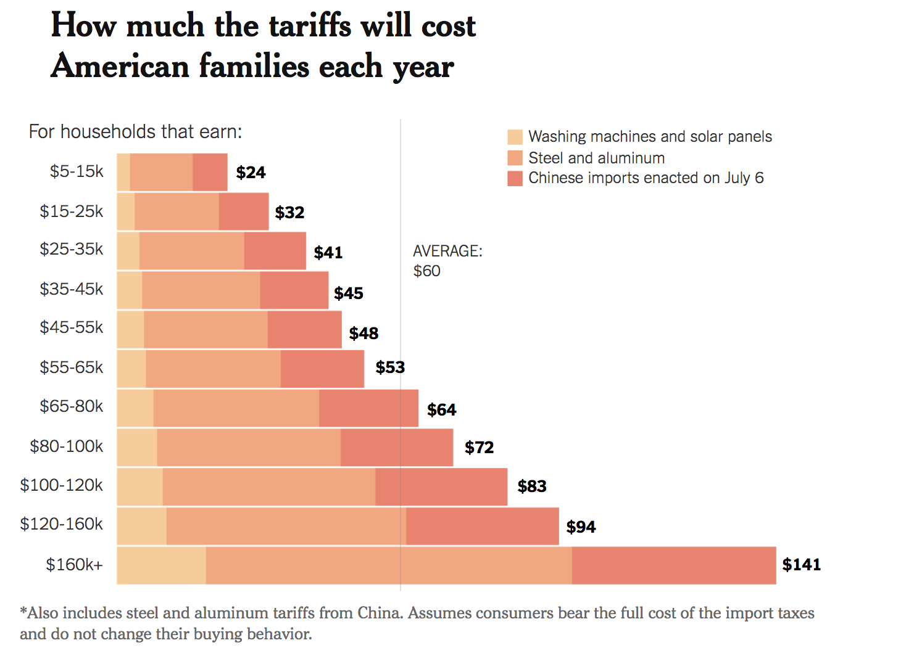

Michael Uftring
Indiana University
V506 - Statistical Analysis, Summer 2018
In-Class Exercise 4

-----

*Graphs are an important tool for communicating data and statistical analysis. A well-constructed graph helps the reader to understand important elements of the data that may not be immediately apparent just from looking at numbers or tables. A poorly constructed graph, however, can confuse the or mislead the audience and be counterproductive.*

- *What are some criteria that you think data analysts should follow when constructing graphs for the general public?*

Always strive for simplicity. The primary objective of data visualization is to effectively present some data in a fashion which conveys the desired concept without bias. Do not construct a graphic which is intentionally misleading; always be transparent and truthful.

Always provide titles, labels and legends. Use annotations when necessary, specifically when wanting to draw attention to something perhaps unexpected or not otherwise clearly illustrated. Do not clutter the graph with unnecessary symbols or annotations, the will only serve to distract. Use truthful scales on the axes; if truncating the y-axis scale then provide a remark indicating why this is the case.

Use appropriate chart types for the type of data being presented. There are different techniques and chart types for effectively showing categorical data and quantitative data. Length and direction are best for conveying magnitude in quantitative data. Shape and color can be very effective for categorical data.

Use color appropriately. Color can be good for categorical data, where each color represents a different category. Use of saturation or brightness will make it difficult to distinguish the different categories, always use different hues. Color is not always good for quantitative data. The best approach is to use different saturation or brightness (e.g., light red to dark red), but it can still be difficult to distinguish values in ranges that are close. If different hues are used in quantitative data there must be a legend to indicate which color is for smaller values and which is used for larger values. There is no real natural ordering of colors to depict low vs. high values. Finally, with respect to color use, we need to be aware of what colors can be perceived by people with different types of colorblindness.

- *Find one example of a graph from a mainstream media outlet (newspaper, magazine, blog, etc…) that you think fits these criteria and include it in your post. If possible, include the graph itself as well as a link to the article or webpage that the graph is taken from (you may not post about a graph that somebody else has already posted about).*

[How Much Will the Trade War Cost a Typical American Family? Around $60 (So Far)](https://www.nytimes.com/interactive/2018/07/12/upshot/trade-war-cost-families.html?rref=collection%2Fsectioncollection%2Fupshot&action=click&contentCollection=upshot&region=rank&module=package&version=highlights&contentPlacement=1&pgtype=sectionfront), NY Times Upshot, By QUOCTRUNG BUI and NEIL IRWIN, JULY 12, 2018

- *What is the graph attempting to show or communicate to the reader?*

This graph is attempting to show the reader the impact to their annual household expenses due to the trade war with China. The graph shows two dimensions: (1) household income grouped into ranges; (2) projected cost impact for three categories of goods.

- *Why do you think it is effective in doing so?*

The graph clearly shows the magnitude of the impact to each income range, with lower impact to lower income ranges and higher impact to higher income ranges. We can also clearly observe the breakdown per category of goods.

- *Are there any elements that you think are particularly well done or that stand out?*

This graph uses color effectively to distinguish the three categories of goods; with this the reader can easily see that goods using steel and aluminum are  having the greatest impact across all income ranges.

- *Finally, find an example of a graph from a mainstream media outlet that you think is about an interesting topic but is poorly constructed and include this in your post as well.*

[Visualizing The U.S. States Most Vulnerable To A Trade War](http://www.thedailyliberty.com/visualizing-us-states-most-vulnerable-trade-war), Submitted by TheDailyLiberty.com on Sat, 04/14/2018 - 09:10.

- *What elements do you think are particularly poor?*

The colors and the sea-shell-like shape make this graphic visually interesting (perhaps it could be called a "pretty" graph), but these elements also make the graphic very busy and challenging to understand everything. The shape and color choices are more distracting than assisting with perception.

Upon spending a few minutes inspecting the graphic you can determine that it is trying to convey two items: (1) each state's GDP in billions of dollars; (2) the percent of each state's GDP which is trade related. The graphic is also trying to convey the rankings of each of those values.

Perceiving the overall impact to each state is really difficult to grasp due to the intermixing of the blue bars which have the GDP values and the red bars which have the percent of GDP related to trade. California being the largest bar overall would suggest that it is the most impacted. However, if we are to consider the percent of trade related to GDP an important indicator of impact, California's 22.4% does not put it in the top 10 impacted states.

The diminishing font size makes it about impossible to perceive some potentially important or interesting numbers: for example, Mississippi's (MS) percent of GDP impacted to trade is colored a darker shade of red, indicating it is one of the more greatly impacted states. However, the small font sizes make it really hard to see what the actual numbers are, which can be important for someone trying to glean useful information from this graphic.

- *How would you improve this graph to better visualize the data?*

The circular shape only distracts, it does nothing to help understand or perceive what it trying to be conveyed. A vertical, ranked bar chart would be more appropriate.

Unstack the two different values in the bars. Each category deserves its own presentation. These should either be two separate charts, or perhaps a dual-axis chart with bars depicting the GDP and an overlaid line chart depicting the percent related to trade. Though, often dual-axis charts can be difficult to understand.

Interestingly, in the article text there are two tables which list the ten most impacted and ten least impacted states by percent of GDP related to trade. I found these tables much more effective in conveying this concept. The takeaway here is that sometimes data is much better presented in tabular form rather than in graphic form.
