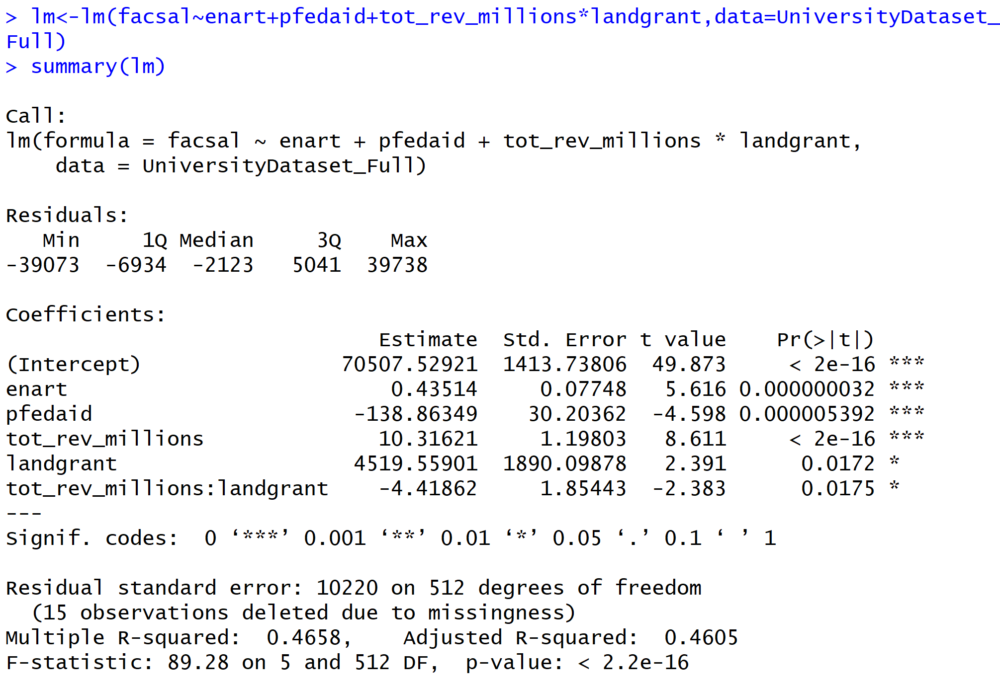
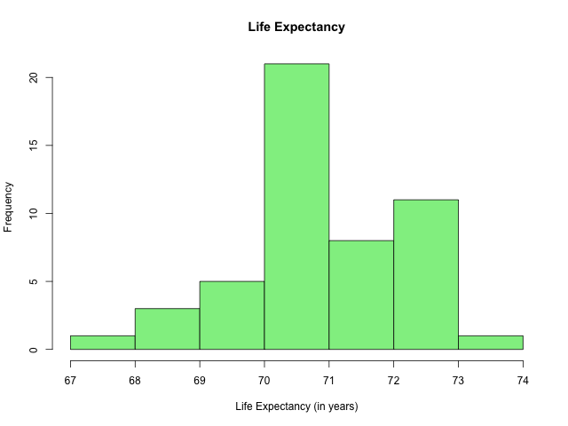
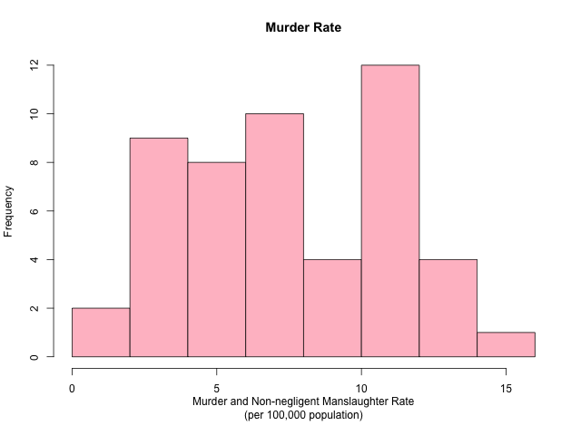
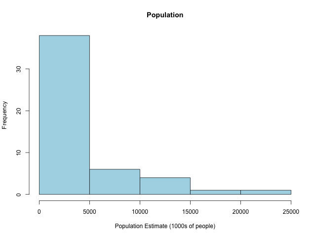
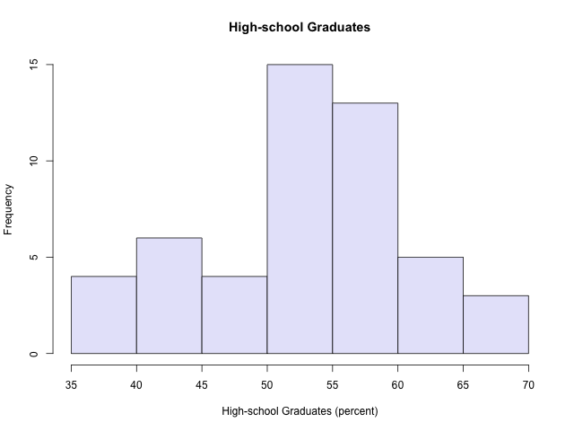
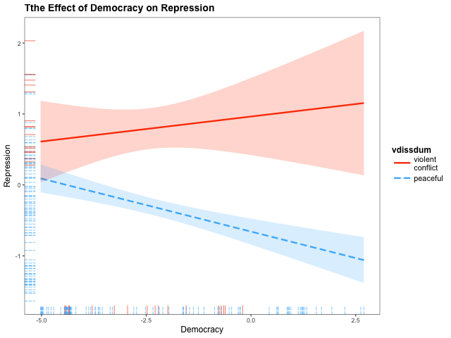

Michael Uftring
Indiana University
V506 - Statistical Analysis, Summer 2018
Final Exam

-----


# Part I: Short Answer Questions
> Answer each of the questions below as completely as possible, showing work wherever appropriate, i.e. whenever computing values).

**1.** *In OLS regression, what does the method of least squares refer to?*

least squares refers to the smallest sum of residuals

**2.** *What does the F statistic in an OLS model (just one model) indicate? What is the null hypothesis regarding this statistic?*

The F-statistic is an effectiveness measure for the overall model. It indicates the extent to which this model improves our prediction of the dependent variable compared to not having any independent variables and using the mean of the dependent variable for prediction.

The null hypothesis in the case of the F-statistic is that none of the explanatory variables have a statistically significant effect on the response variable. This is expressed as all $\beta$ coefficients are equal to zero.

$H_{0}: \beta_{1} = \beta_{2} = ... = \beta_{k} = 0$

**3.** *What does the Pearson correlation coefficient tell us about the relationship between two variables? Suppose that this coefficient for two variables is 0.8. What would that indicate about the relationship between the two variables? What if the coefficient was -0.8. What if it was 0.1?*

The correlation coefficient measures the strength of the relationship between two variables. The larger the absolute value of the correlation coefficient, the stronger the relationship. The sign indicates the direction of the relationship: positive or negative.

A value of 0.8 indicates a very strong positive relationship.

A value of -0.8 indicates a very strong negative relationship.

A value of 0.1 indicates that there is essentially no relationship.

**4.** *Suppose that in a bivariate regression model, the effect of an independent variable on the dependent variable is positive and statistically significant, but when a second variable is added to the model, the effect of the original independent variable becomes negative and statistically significant. Explain why this would occur. What implications does this have for model specification in terms of omitting independent variables?*

This indicates that there is likely a spurious relationship between $x_{1}$ (the original independent variable) and $y$ due to a mutual dependence on $x_{2}$ (the second independent variable), which further indicates that $x_{2}$ is likely the common causal factor.

In the bivariate case $x_{1}$ has a positive association with $y$. The multiple regression which includes $x_{2}$ uncovers the true negative relationship between $x_{1}$ and ${y}$. Even if in a bivariate model we observe $x_{2}$ having a strong positive association with $y$, if $x_{1}$ and $x_{2}$ are also correlated, we cannot discount $x_{1}$'s importance (or exclude it from the model). With the multivariate model we have more predictive accuracy on the response variable by including both explanatory varaibles.

This is a case of **Simpson's Paradox.**

The implications raise ethical and moral questions. This situation has the ability to create opportunity for bias and producing an intentionally misleading model. For example, if someone wanted to implicate the first explanatory variable as the sole causal connection for significantly higher levels in the response variable (perhaps in an attempt to exonerate the second explanatory variable), they would exclude the second explanatory variable from the model.

**5.** *Given the least squares regression equation, Ŷ = 1,202 + 1,133X, when X = 3, what does Ŷ equal?*

$\hat{y} = 1202 + 1133x$
$\hat{y} = 1202 + 1133(3)$
$\hat{y} = 1202 + 3399$
$\hat{y} = 4601$

**6.** *It has been hypothesized that overall academic success for college freshmen as measured by grade point average (GPA) is a function of IQ scores = X<sub>1</sub>, and hours spent studying each week = X<sub>2</sub>. Suppose the regression equation is:*

Ŷ = -5.7 + 0.055X<sub>1</sub> +0.107X<sub>2</sub>

*What is the predicted GPA for a student with an IQ of 108, and 32 hours spent studying per week?*

$x_{1}:$ IQ score
$x_{2}:$ hours spent studying each week
$\hat{y}:$ predicted grade point average

$\hat{y} = -5.7 + 0.055x_{1} + 0.107x_{2}$
$\hat{y} = -5.7 + 0.055(108) + 0.107(32)$
$\hat{y} = -5.7 + 5.94 + 3.424$
$\hat{y} = 3.664$

**7.** *A manager at a local bank analyzed the relationship between monthly salary and three independent variables: length of service (measured in months), gender (0 = female, 1 = male), and job type (0 = clerical, 1 = technical). The table below summarizes the regression results. Interpret the coefficients and t-statistics for the Job and Gender variables.*

|           | Coefficients | Standard Error | t Stat  | p-value |
| --------- | -----------: | -------------: | ------: | ------: |
| Intercept | 784.92       | 322.25         |  2.44   | 0.02    |
| Service   |   9.19       |   3.20         |  2.87   | 0.01    |
| Gender    | 222.78       |  89.00         |  2.50   | 0.02    |
| Job       | -28.21       |  89.61         | -0.31   | 0.76    |

Gender has a positive association with Monthly Salary. Male employees (gender = 1) experience a 222.78 unit increase in Monthly Salary over females; and with a p-value of 0.02, there is strong evidence that Monthly Salary is related to Gender controlling for all other variables in the model.

In this model Job has a negative association with Monthly Salary. Technical jobs may exhibit a 28.21 unit decrease in Monthly Salary compared to clerical jobs. But, with a p-value of 0.76 there is little to no statistical significance and we cannot conclude that Monthly Salary is related to Job even when controlling for all other variables in the model.

**8.** *A multiple regression model includes the interaction term (X<sub>1</sub>)(X<sub>2</sub>), and the resulting coefficient is positive and statistically significant. What does this term imply about the effect of X<sub>1</sub> on Y?*

There is a positive association between $x_{1}$ and $y$ that varies according to the level of $x_{2}$.

**9.** *The sales manager of a large automotive parts distributor wants to estimate as early as April the total annual sales. According to the manager of the distribution warehouse, several factors are related to annual sales (measured in millions of dollars) (sales), including the number of retail outlets in the region stocking the company’s parts (outlets), the number of automobiles in the region registered as of April 1 (measured in millions) (cars), the total personal income for the first quarter of the year (measured in billions of dollars) (income), the average age of automobiles in years (age), and the number of supervisors at the distribution warehouse (bosses). The data for all these variables were gathered for a recent year.*

*Consider the following correlation matrix.*

|       |sales |outlets|cars  |income|age  |
|-------|-----:|------:|-----:|-----:|----:|
|outlets|0.899 |
|cars   |0.605 |0.775  |
|income |0.964 |0.825  |0.409 |
|age    |-0.323|-0.489 |-0.447|-0.349|
|bosses |0.286 |0.183  |0.395 |0.155 |0.291|


- **A.** *Which single variable has the strongest correlation with the dependent variable?*

With a correlation value of 0.964, `income` has the strongest correlation with the dependent variable `sales.`

- **B.** *Is there evidence of multicollinearity? If so, between which variables?*

Yes. The relatively high correlation value of 0.825 between the explanatory variables `outlets` and `income` is evidence of multicollinearity.

**10.** Using the same data described above, the following multivariate regression equation was estimated:

|         |Coef     |SE Coef |t statistic|p    |
|---------|--------:|-------:|----------:|----:|
|Intercept|-19.672  |5.422   |-3.63      |0.022|
|Outlets  |-0.000629|0.000213|-2.96      |0.018|
|Cars     |1.7399   |0.5530  |3.15       |0.035|
|Income   |0.40994  |0.04385 |9.35       |0.001|
|Age      |2.0357   |0.65247 |3.12       |0.014|
|Bosses   |-0.0344  |0.01128 |-3.05      |0.016|

ANOVA
|SOURCE        |DF  |Sum of Squares|Mean Square|F     |P    |
|--------------|----|--------------|-----------|------|-----|
|Regression    |5   |1593.81       |318.76     |140.36|0.000|
|Residual Error|4   |9.08          |2.27       |
|Total         |9   |1602.89       |

- **A.** *State the null hypothesis concerning the statistical significance of the overall regression, test this hypothesis, and interpret the results. (use a .05 level of significance)*

Here we are testing the collective influence of the explanatory variables. The null hypothesis claims that none of the explanatory variables have a relationship with the response variable. The alternative hypothesis claims that at least one of the explanatory variables has a relationship with the response variable.

$H_{0}: \beta_{1} = \beta_{2} = \beta_{3} = \beta_{4} = \beta_{5} = 0$
$H_{a}: At \: least \: one \: \beta_{i} \ne 0$

We test this using the F-statistic

$n$: the sample size (10)
$k$: the number of parameters in the multiple regression (5)
$df_{1}$: the number of explanatory variables in the model, $k$
$df_{2}$: $n$ - the number of parameters in the regression equation, $n - (k + 1)$

$F = \frac{R^{2}/k}{(1 - R^{2})/[n - (k + 1)]}$

$F = \frac{0.994/5}{(1 - 0.994)/[10 - (5 + 1)]}$

$F = 8.283$
$df_{1} = k = 5$
$df_{2} = n - (k + 1) = 4$

Consulting Table D: F Distribution, with $df_{1} = k = 5$, and $df_{2} = n - (k + 1) = 4$, for $\alpha = 0.05$, the F-value is 6.26. Our observed F-statistic value of 8.238 is greater than this F-value, indicating it is further out in the tail and has smaller tail-probability than 0.05 (the P-value is < 0.05). This means that there is sufficient evidence to reject the null hypothesis and accept the alternative hypothesis: we can conclude that at least one of the explanatory variables has a relationship with the response variable with statistical significance and a 95% confidence interval.

- **B.** *What is the value of the coefficient of determination, i.e., r-squared (note for this example, you do NOT need to compute adjusted r-squared)? Based on this value, what percent of the variation in the dependent variable is explained by the regression equation?*

$TSS = 1602.89$
$SSE = 9.08$

$R^{2} = \frac{TSS-SSE}{TSS}$

$R^{2} = \frac{1602.89-9.08}{1602.89}$

$R^{2} = \frac{1593.81}{1602.89}$

$R^{2} = 0.994$

This model predicts or explains approximately 99.4% of the variation in the dependent variable.

- **C.** *Interpret the results (both statistical significance and magnitude of effect) for each of the independent variables in the model. (Use a .05 level of significance)*

The number of retail outlets in the region has a very small negative influence on total annual sales, for every one-unit change in outlets there is a -0.000629 unit change in total annual sales. This effect is 95% statistically significant with P-value 0.018.

The number of automobiles in the region (in millions) has a positive association with total annual sales, for every one-unit it increases total sales increases 1.7399 units. While the P-value of 0.035 is the highest of all factors in the model, this explanatory variable is still statistically significant at the 95% confidence level in explaining variation in the response variable.

The total personal income (in billions of dollars) is the most statistically significant in the model; the P-value of 0.001 is well within tolerance of the 95% confidence interval, and is in fact in the >99% confidence level. Still, the positive influence of total personal income is not as great as other factors, for every one-unit of increase we see a 0.40994 unit increase in total annual sales while controlling for all other explanatory variables.

The average age of automobiles (in years) accounts for the greatest positive shift in total annual sales by all explanatory variables. For every one-unit increase in age the total annual sales increases 2.0357 units, holding all other explanatory variables constant at zero. With a P-value of 0.014, this is statistically significant at the 95% confidence level.

Perhaps the most curious of factors in the model, the number of supervisors at the distribution warehouse is indeed a statistically significant predictor of variation of total annual sales. The P-value of 0.016 makes it significant within the 95% confidence level. The association is slightly negative; when controlling for all other variables, for every one-unit increase in bosses the total annual sales decreases by -0.0344 units.

- **D.** *What would be the projected value in annual sales if the following were true?*
*outlets = 1739, cars = 9.27, income  = 85.4, age  = 3.5, and bosses  = 9.0*
*If these values are outside the range of values used for the regression, would this be a reliable forecast? Why or why not?*

$x_{1}$: Outlets
$x_{2}$: Cars
$x_{3}$: Income
$x_{4}$: Age
$x_{5}$: Bosses

$\hat{y} = \alpha + \beta_{1}x_{1} + \beta_{2}x_{2} + \beta_{3}x_{3} + \beta_{4}x_{4} + \beta_{5}x_{5}$
$\hat{y} = -19.672 + -0.000629x_{1} + 1.7399x_{2} + 0.40994x_{3} + 2.0357x_{4} + -0.0344x_{5}$
$\hat{y} = -19.672 + -0.000629(1739) + 1.7399(9.27) + 0.40994(85.4) + 2.0357(3.5) + -0.0344(9.0)$
$\hat{y} = 37.187$ (millions of dollars)

If these values are outside the range of values used for the regression, then the forecast would not be reliable. Linear Regression, whether bivariate or multivariate, is best suited to interpolate values. Linear Regression is not suitable for extrapolation because we don't know if the linear prediction equation derived from the range of values in the sample data remains representative outside of their bounds.

**11.** *Suppose you are a research assistant to a young assistant professor who is very interested in predicting faculty salaries at US public colleges and universities. To do so, you estimate a linear regression model with faculty salaries (facsal) as the dependent variable, and you include four independent variables: total enrollment (enart), % of students receiving federal aid (pfedaid), whether an institution is a Landgrant college or university (landgrant), and total revenues in millions of dollars (tot_rev_millions). Note that landgrant is a dichotomous (dummy) variable while the other variables are all continuous variables.*

*Because you suspect that there may be an interactive effect between Landgrant institutions (landgrant) and total revenues in $ millions (tot_rev_millions), you include an interaction term in the model for these two variables (landgrant\*tot_rev). The the output of the linear regression model is below.*



- **A)** *Interpret the base coefficients for landgrant, and tot_rev_millions, as well as the interaction term (tot_rev_millions:landgrant), both in terms of statistical significance and in terms of their impact on the dependent variable.*

For this model, when an institution is a Landgrant college or university the faculty salary is on average 4519.55901 higher than non-Landgrant institutions. The P-value of 0.0172 indicates that this is statistrically significant with 95% confidence interval.

The total revenue (in millions of dollars) is highly significant, it's P-value is extremely small and indicates a 99.9% confidence interval. For every one-unit increase in total revenue (in millions of dollars), the expected faculty salary increases by 10.31621 units (dollars).

The interaction term between total revenue and landgrant status is indicating that there is a negative effect on faculty salary when an institution is a Landgrant college or university scaled by total revenue; when an institution is not (landgrant = 0), then this term will equal zero and have no positive or negative effect. With a P-value of 0.0175, this is statistically significant at the 95% level.

- **B)** *Based on your regression model, what is the predicted faculty salary for the following two hypothetical institutions:*

Using:

$y$: faculty salary
$x_{1}$: total enrollment (enart)
$x_{2}$: % of students receiving federal aid (pfedaid)
$x_{3}$: total revenues in millions of dollars (tot_rev_millions)
$x_{4}$: whether an institution is a Landgrant college or university (landgrant)

The multiple regression formula is:

$\hat{y} = 70507.52921 + 0.43514x_{1} + -138.86349x_{2} + 10.31621x_{3} + 4519.55901x_{4} + -4.41862x{3}x{4}$

```
Total Enrollment = 20,000
% Receiving Federal Financial Aid = 25
Total Revenues = $30 Million
Landgrant = 1
```
$\hat{y} = 70507.52921 + 0.43514(20000) + -138.86349(25) + 10.31621(30) + 4519.55901(1) + -4.41862(30)(1)$
$\hat{y} = 70507.52921 + 8702.8 + -3471.58725 + 309.4863 + 4519.55901 + -132.5586$
$\hat{y} = 80435.22867$ (dollars)

```
Total Enrollment = 20,000
% Federal Receiving Financial Aid = 25
Total Revenues = $30 Million
Landgrant = 0
```
$\hat{y} = 70507.52921 + 0.43514(20000) + -138.86349(25) + 10.31621(30) + 4519.55901(0) + -4.41862(30)(0)$
$\hat{y} = 70507.52921 + 8702.8 + -3471.58725 + 309.4863 + 0 + 0$
$\hat{y} = 76048.22826$ (dollars)

# Part II: R Programming
> Include both the output and relevant R code in your answer.

**1.** Download the statelife_exp.csv file and load it into R. This dataset contains the following variables:

- `State`: name of state
- `Population`: population estimate as of July 1, 1975
- `Income`: per capita income (1974)
- `Illiteracy`: illiteracy (1970, percent of population)
- `Life Exp`: life expectancy in years (1969–71)
- `Murder`: murder and non-negligent manslaughter rate per 100,000 population (1976)
- `HS Grad`: percent high-school graduates (1970)
- `Frost`: mean number of days with minimum temperature below freezing (1931–1960) in capital or large city
- `Area`: land area in square miles

Estimate an OLS model where life expectancy is the dependent variable, and the following are independent variables: murder rate, population, percent high-school graduates.

- **A)** *Construct a table containing summary descriptive statistics for all of the variables in the model (both IVs and DV), and construct histograms for each variable.*

|Variable  |Mean    |Median  |Mode   |Range    |Min    |Max      |Variance    |Standard<br>Deviation|Standard<br>Error|
|----------|--------|--------|-------|---------|-------|---------|------------|------------------|--------------|
|Life.Exp  |70.879  |70.675  |70.550 |5.640    |67.960 |73.600   |1.802       |1.342             |0.190         |
|Murder    |7.378   |6.850   |2.300  |13.700   |1.400  |15.100   |13.627      |3.692             |0.522         |
|Population|4246.420|2838.500|365.000|20833.000|365.000|21198.000|19931683.759|4464.491          |631.374       |
|HS.Grad   |53.108  |53.250  |38.500 |29.500   |37.800 |67.300   |65.238      |8.077             |1.142         |






```
> library(readr)
> library(DescTools)
> library(car)
> statelife_exp <- read_csv("statelife_exp.csv")
Parsed with column specification:
cols(
  State = col_character(),
  Population = col_integer(),
  Income = col_integer(),
  Illiteracy = col_double(),
  Life.Exp = col_double(),
  Murder = col_double(),
  HS.Grad = col_double(),
  Frost = col_integer(),
  Area = col_integer()
)
> View(statelife_exp)
> compute.stats <- function(n, v) {
+   v.mean = mean(v, na.rm=T)
+   v.median = median(v, na.rm=T)
+   v.mode = Mode(v, na.rm=T)[1]
+   v.result <- range(v, na.rm=T)
+   v.min <-v.result[1]
+   v.max <- v.result[2]
+   v.range <- v.max - v.min
+   v.var = var(v, na.rm=T)
+   v.sd = sd(v, na.rm=T)
+   v.sem <- sd(v, na.rm=TRUE)/sqrt(length(v))
+   #print(sprintf("variable: %s mean: %.3f median: %.3f mode = %.3f range: %.3f (%.3f - %.3f) variance: %.3f stddev: %.3f stderr: %.3f",
+   #             n, v.mean, v.median, v.mode, v.range, v.min, v.max, v.var, v.sd, v.sem))
+   print(sprintf("%s,%.3f,%.3f,%.3f,%.3f,%.3f,%.3f,%.3f,%.3f,%.3f",
+                 n, v.mean, v.median, v.mode, v.range, v.min, v.max, v.var, v.sd, v.sem))
+
+   return(c(v.mean, v.median, v.mode, v.range, v.min, v.max, v.var, v.sd, v.sem))
+ }
> # (a) Construct a table containing summary descriptive statistics for all of the variables
> # in the model (both IVs and DV), and construct histograms for each variable.
> df <- data.frame(matrix(ncol = 9, nrow = 4))
> df <- c("Mean","Median","Mode","Range","Min","Max","Variance","StandardDeviation","StandardError")
> df <- rbind(df,compute.stats("Life.Exp", statelife_exp$Life.Exp))
[1] "Life.Exp,70.879,70.675,70.550,5.640,67.960,73.600,1.802,1.342,0.190"
> df <- rbind(df,compute.stats("Murder", statelife_exp$Murder))
[1] "Murder,7.378,6.850,2.300,13.700,1.400,15.100,13.627,3.692,0.522"
> df <- rbind(df,compute.stats("Population", statelife_exp$Population))
[1] "Population,4246.420,2838.500,365.000,20833.000,365.000,21198.000,19931683.759,4464.491,631.374"
> df <- rbind(df,compute.stats("HS.Grad", statelife_exp$HS.Grad))
[1] "HS.Grad,53.108,53.250,38.500,29.500,37.800,67.300,65.238,8.077,1.142"
> row.names(df) <- c("Variable","Life.Exp","Murder","Population","HS.Grad")
> print(df)
           [,1]      [,2]     [,3]    [,4]    [,5]    [,6]    [,7]               [,8]
Variable   "Mean"    "Median" "Mode"  "Range" "Min"   "Max"   "Variance"         "StandardDeviation"
Life.Exp   "70.8786" "70.675" "70.55" "5.64"  "67.96" "73.6"  "1.80202044897959" "1.34239355219682"
Murder     "7.378"   "6.85"   "2.3"   "13.7"  "1.4"   "15.1"  "13.6274653061224" "3.69153969315277"
Population "4246.42" "2838.5" "365"   "20833" "365"   "21198" "19931683.7587755" "4464.49143338584"
HS.Grad    "53.108"  "53.25"  "38.5"  "29.5"  "37.8"  "67.3"  "65.237893877551"  "8.07699782577357"
           [,9]
Variable   "StandardError"
Life.Exp   "0.189843116755894"
Murder     "0.522062550009526"
Population "631.374433419275"
HS.Grad    "1.1422599868467"
> plot.histogram <- function(data, title, color, xlabel, filename) {
+   png(filename, width = 640, height = 480)
+   hist(data, main = title, col = color, xlab = xlabel)
+   dev.off()
+ }
> plot.histogram(statelife_exp$Life.Exp,"Life Expectancy", "lightgreen", "Life Expectancy (in years)", "analysis-1a-lifeexp.png")
RStudioGD
        2
> plot.histogram(statelife_exp$Murder, "Murder Rate", "pink", "Murder and Non-negligent Manslaughter Rate\n(per 100,000 population)", "analysis-1a-murderp.png")
RStudioGD
        2
> plot.histogram(statelife_exp$Population, "Population", "lightblue", "Population Estimate (1000s of people)", "analysis-1a-population.png")
RStudioGD
        2
> plot.histogram(statelife_exp$HS.Grad, "High-school Graduates", "lavender",  "High-school Graduates (percent)", "analysis-1a-hsgrad.png")
RStudioGD
        2
```

- **B)** *Interpret the results of the model, both substantively and statistically. Be sure to discuss both the model as a whole as well (F statistic and adjusted r-squared), as well as the results for each independent variable in the model (coefficient, t-statistic, and p-value).*

```
> model1 <- lm(Life.Exp~Murder+Population+HS.Grad, data=statelife_exp)
> summary(model1)

Call:
lm(formula = Life.Exp ~ Murder + Population + HS.Grad, data = statelife_exp)

Residuals:
     Min       1Q   Median       3Q      Max
-1.60049 -0.45970  0.05036  0.44988  2.26044

Coefficients:
              Estimate Std. Error t value Pr(>|t|)
(Intercept)  7.041e+01  9.686e-01  72.700  < 2e-16 ***
Murder      -2.664e-01  3.574e-02  -7.454 1.91e-09 ***
Population   6.250e-05  2.592e-05   2.411   0.0199 *
HS.Grad      4.075e-02  1.541e-02   2.644   0.0112 *
---
Signif. codes:  0 ‘***’ 0.001 ‘**’ 0.01 ‘*’ 0.05 ‘.’ 0.1 ‘ ’ 1

Residual standard error: 0.758 on 46 degrees of freedom
Multiple R-squared:  0.7007,	Adjusted R-squared:  0.6812
F-statistic: 35.89 on 3 and 46 DF,  p-value: 4.15e-12
```

With three explanatory variables, the adjusted $R^{2}$ value indicates that our model explains approximately 68.1% of the variation in the response variable: Life Expectancy. Our F-statistic of 35.89 indicates that the model as a whole significantly improves our predictive ability, and with P-value of 4.15e-12 we can conclude this is statistically significant at the 99% confidence interval.

Of the three independent variables in the model, Murder is the most statistically significant; with an extremely small P-value of 1.91e-09 (0.00000000191) it is significant at >99% confidence interval. Murder has a negative association with Life Expectancy, where for every one-unit increase (per 100,000), Life Expectancy decreses by 0.2664 units (years) when controlling for other variables.

Population (1000s of people) and High-School Graduation (percent) are less statistically significant, with P-values of 0.0199 and 0.0112 respectively they fall into the 95% confidence interval. Both have slight positive associations with Life Expectancy, where their single-unit increases incur only fractional increases in Life Expectancy.

- **C)** *Estimate a new model with the same DV and set of IVs listed earlier, but add a new independent variable for the mean number of days with minimum temperature below freezing. Interpret the results of this model (same procedure as in part B).*

```
> model2 <- lm(Life.Exp~Murder+Population+HS.Grad+Frost, data=statelife_exp)
> summary(model2)

Call:
lm(formula = Life.Exp ~ Murder + Population + HS.Grad + Frost,
    data = statelife_exp)

Residuals:
     Min       1Q   Median       3Q      Max
-1.47095 -0.53464 -0.03701  0.57621  1.50683

Coefficients:
              Estimate Std. Error t value Pr(>|t|)
(Intercept)  7.103e+01  9.529e-01  74.542  < 2e-16 ***
Murder      -3.001e-01  3.661e-02  -8.199 1.77e-10 ***
Population   5.014e-05  2.512e-05   1.996  0.05201 .
HS.Grad      4.658e-02  1.483e-02   3.142  0.00297 **
Frost       -5.943e-03  2.421e-03  -2.455  0.01802 *
---
Signif. codes:  0 ‘***’ 0.001 ‘**’ 0.01 ‘*’ 0.05 ‘.’ 0.1 ‘ ’ 1

Residual standard error: 0.7197 on 45 degrees of freedom
Multiple R-squared:  0.736,	Adjusted R-squared:  0.7126
F-statistic: 31.37 on 4 and 45 DF,  p-value: 1.696e-12
```

Adding Frost (number of days) to the model has improved the ability of the model to explain variation in Life Expectancy to 71.3%. The F-statistic value has decreased some, but remains highly statistically significant at 99% confidence interval. Overall we can conclude that Frost is helping the predictive ability of the model, but not greatly.

By itself, the coefficient for Frost indicates that the predicted difference in Life Expectancy is -5.943e-03 holding all other dependent variables constant. This is a negative association, which means for every one-unit increase in Frost (measured in days) results in a 0.005943 decrease in Life Expectancy (measured in years). This effectively means that there would need to be 168.265 days with minimum temperature below freezing in order to decrease Life Expectancy by 1 year. This is statistically significant at 95% confidence interval.

Thre predictive nature of Murder, Population and High-School Graduation are not changed much in this model. Murder remains highly statistically significant, and has approximately the same negative association. Population has lost some statistical significance in this model, now falling into the 95% confidence interval; it has also lost some of its positive association power over Life Expectancy. The magnitude of positive association for High-School Graduation is approximately the same.

- **D)** *Next, conduct a nested F-test to determine if adding this new variable improved the explanatory power of the model.*

```
> anova(model1, model2)
Analysis of Variance Table

Model 1: Life.Exp ~ Murder + Population + HS.Grad
Model 2: Life.Exp ~ Murder + Population + HS.Grad + Frost
  Res.Df    RSS Df Sum of Sq      F  Pr(>F)
1     46 26.430
2     45 23.308  1    3.1218 6.0271 0.01802 *
---
Signif. codes:  0 ‘***’ 0.001 ‘**’ 0.01 ‘*’ 0.05 ‘.’ 0.1 ‘ ’ 1
```

The Nested F-test here tells us that with a P-value of 0.01802 the more complicated model (in Part C, with Frost) is better than the simpler model (without Frost) with a 95% confidence interval. So we can conclude that the more complicated model has improved our explanatory ability to predict Life Expectancy.

**2.** Download the violent_dissent.csv file and load it into R. This data contains information about violent internal dissent, democracy and state repression for 1984. The variables in the dataset are as follows:

- `ccode`: Numeric COW country code
- `pop`: population in thousands
- `rgpdpch`: Real GPD per capita
- `democracy`: Behavioral measure of democracy including legislative competition/participation, competitiveness of executive recruitment and participation, along with other factors. This is a continuous measure. Higher numbers indicate greater levels of democracy.
- `vdissdum`: Binary violent dissent variable (dummy variable) based on data regarding terrorist events and fatalities, as well as guerrilla wars and riots. 0=country is peaceful; 1=country is in state of violent conflict
- `repression`: Violations of physical integrity rights. A continuous measure based on human rights data regarding torture, forced disappearances, extrajudicial killings and political imprisonment. Higher numbers indicate greater levels of repression.

Estimate an OLS regression model where repression is the dependent variable, and pop, rgdpch, democracy, and vdissdum are the independent variables.

- **A)** *Interpret the results of the model, both substantively and statistically. Be sure to discuss both the model as a whole (F statistic and adjusted r-squared), as well as the results for each independent variable in the model (coefficient, t-statistic, and p-value).*

```
> model1 <- lm(repression~pop+rgdpch+democracy+vdissdum , data=violent_dissent)
> summary(model1)

Call:
lm(formula = repression ~ pop + rgdpch + democracy + vdissdum,
    data = violent_dissent)

Residuals:
     Min       1Q   Median       3Q      Max
-1.32767 -0.39815 -0.05255  0.34542  1.83781

Coefficients:
              Estimate Std. Error t value Pr(>|t|)
(Intercept) -3.972e-01  1.420e-01  -2.797  0.00613 **
pop          1.955e-07  4.460e-07   0.438  0.66196
rgdpch      -3.294e-05  1.042e-05  -3.160  0.00205 **
democracy   -1.311e-01  2.952e-02  -4.443 2.18e-05 ***
vdissdum     1.076e+00  1.606e-01   6.700 1.01e-09 ***
---
Signif. codes:  0 ‘***’ 0.001 ‘**’ 0.01 ‘*’ 0.05 ‘.’ 0.1 ‘ ’ 1

Residual standard error: 0.5817 on 107 degrees of freedom
Multiple R-squared:  0.5608,	Adjusted R-squared:  0.5444
F-statistic: 34.16 on 4 and 107 DF,  p-value: < 2.2e-16
```

The F-statistic of 34.16 with extremely small P-value generally indicate that this model is operating well overall, with a very high statistical significance of > 99%. But with only a 54.4% ability to explain variation in `repression` (violations of physical integrity rights), this model seems only moderately acceptable, and could use some improvement.

Three of the four explanatory variables are highly statistically significant, at 99% and higer: `rgdpch`, `democracy`, and `vdissdum`. Real GPD per capita and the Behavioral measure of democracy both have negative associations with `repression` (violations of physical integrity rights). This seems logical: as a country's economy grows, and as the government moves more towards a democracy, the amount of violations of physical integrity rights should decrease.

The `vdissdum` (binary: violent dissent) independent variable behaves as expected. When a country is peaceful (`vdissdum` = 0), violent dissent has no impact on `repression` (violations of physical integrity rights). However, when a country is in state of violent conflict (`vdissdum` = 0) this model predicts a 1.076 unit increase in `repression` (there are greater levels of repression: torture, forced disappearances, extrajudicial killings and political imprisonment), when controlling for all other variables. This is statistically significant at greater than the 99% confidence interval.

Not unsurprisingly, the size of a country's population (in thousands) does not lend towards any predictive power of violations of physical integrity rights. These problems are not isolated to small or large countries; a country of any size could be susceptible.

- **B)** *Some hypothesize that the effect of democracy on repression is conditional and works differently in peaceful countries than in countries in a state of violent conflict. To test this hypothesis, add a multiplicative interaction term to the model for democracy and vdissdum (democracy*vdissdum). Interpret the model results (using the same procedure as part A).*

```
> model2 <- lm(repression~pop+rgdpch+democracy*vdissdum , data=violent_dissent)
> summary(model2)

Call:
lm(formula = repression ~ pop + rgdpch + democracy * vdissdum,
    data = violent_dissent)

Residuals:
     Min       1Q   Median       3Q      Max
-1.35864 -0.38369 -0.03234  0.33612  1.85534

Coefficients:
                     Estimate Std. Error t value Pr(>|t|)
(Intercept)        -4.506e-01  1.417e-01  -3.180  0.00193 **
pop                 2.120e-08  4.454e-07   0.048  0.96212
rgdpch             -3.040e-05  1.031e-05  -2.949  0.00392 **
democracy          -1.493e-01  3.017e-02  -4.948 2.83e-06 ***
vdissdum            1.621e+00  2.947e-01   5.502 2.63e-07 ***
democracy:vdissdum  2.196e-01  1.002e-01   2.191  0.03063 *
---
Signif. codes:  0 ‘***’ 0.001 ‘**’ 0.01 ‘*’ 0.05 ‘.’ 0.1 ‘ ’ 1

Residual standard error: 0.5716 on 106 degrees of freedom
Multiple R-squared:  0.5799,	Adjusted R-squared:  0.5601
F-statistic: 29.26 on 5 and 106 DF,  p-value: < 2.2e-16
```

Adding the interaction term between `democracy` and `vdissdum` slightly increased $R^{2}$ which raises the ability to explain variation in `repression` from 54.4% to 56.0%. However, the F-statistic value decreased which suggests that this model is not improving our explanatory ability over the first model. These results remain highly statistically significant, over 99%, with a very small P-value < 2.2e-16.

The results for all of the other independent variables are approximately the same.

- **C)** *Next, conduct a nested F-test to determine if adding the interaction term for democracy*vdissdum improved the explanatory power of the model.*

```
> anova(model1, model2)
Analysis of Variance Table

Model 1: repression ~ pop + rgdpch + democracy + vdissdum
Model 2: repression ~ pop + rgdpch + democracy * vdissdum
  Res.Df    RSS Df Sum of Sq      F  Pr(>F)
1    107 36.202
2    106 34.633  1    1.5687 4.8013 0.03063 *
---
Signif. codes:  0 ‘***’ 0.001 ‘**’ 0.01 ‘*’ 0.05 ‘.’ 0.1 ‘ ’ 1
```

The null hypothesis suggests that the simpler model is better. The alternative hypothesis suggests that the more complex model is better. The nested F-test results help us determine which hypothesis to reject and which hypothesis to accept. Given the resulting P-value of 0.03063, we must carefully consider which $\alpha$ level we aim to measure the results against.

The F-test results indicate that there is statistical significance at the 95% level, and sufficient evidence to therefore reject the null hypothesis and conclude that the more commplex model is better. But, it is not at an overwhelming level. If we were aiming for higher statistical significance levels we would be in the opposite position: reject the alternative hypothesis and accept the null; the simpler model is better.

Given that the $R^{2}$ in each model reflected very similar ability to explain variation in `repression`, 54.4% ability for the simple model and 56.0% ability for the complex model, and that the nested F-test provided a P-value of 0.03063, which is only significant at 95%, we might conclude that it is a toss up: neither model performs significantly better (or worse) than the other.

- **D)** *Finally, based on the model estimated in part B, construct an effects plot to show the effect of democracy on repression for peaceful and for violent countries. Be sure to include a legend and appropriately label your axes.*



# Appendix - R Code
## State Life Expectancy
```
# Michael Uftring
# Indiana University
# V506 - Statistical Analysis, Summer 2018
# Final Exam : analysis of State Life Expectancy data
# --------------------------------------------------

library(readr)
library(DescTools)
library(car)

statelife_exp <- read_csv("statelife_exp.csv")
View(statelife_exp)

compute.stats <- function(n, v) {
  v.mean = mean(v, na.rm=T)
  v.median = median(v, na.rm=T)
  v.mode = Mode(v, na.rm=T)[1]
  v.result <- range(v, na.rm=T)
  v.min <-v.result[1]
  v.max <- v.result[2]
  v.range <- v.max - v.min
  v.var = var(v, na.rm=T)
  v.sd = sd(v, na.rm=T)
  v.sem <- sd(v, na.rm=TRUE)/sqrt(length(v))
  #print(sprintf("variable: %s mean: %.3f median: %.3f mode = %.3f range: %.3f (%.3f - %.3f) variance: %.3f stddev: %.3f stderr: %.3f",
  #             n, v.mean, v.median, v.mode, v.range, v.min, v.max, v.var, v.sd, v.sem))
  print(sprintf("%s,%.3f,%.3f,%.3f,%.3f,%.3f,%.3f,%.3f,%.3f,%.3f",
                n, v.mean, v.median, v.mode, v.range, v.min, v.max, v.var, v.sd, v.sem))

  return(c(v.mean, v.median, v.mode, v.range, v.min, v.max, v.var, v.sd, v.sem))
}

# This dataset contains the following variables:
# `State`: name of state
# `Population`: population estimate as of July 1, 1975
# `Income`: per capita income (1974)
# `Illiteracy`: illiteracy (1970, percent of population)
# `Life Exp`: life expectancy in years (1969–71)
# `Murder`: murder and non-negligent manslaughter rate per 100,000 population (1976)
# `HS Grad`: percent high-school graduates (1970)
# `Frost`: mean number of days with minimum temperature below freezing (1931–1960) in capital or large city
# `Area`: land area in square miles

# Estimate an OLS model where life expectancy is the dependent variable,
# and the following are independent variables: murder rate, population,
# percent high-school graduates.

# (a) Construct a table containing summary descriptive statistics for all of the variables
# in the model (both IVs and DV), and construct histograms for each variable.
df <- data.frame(matrix(ncol = 9, nrow = 4))
df <- c("Mean","Median","Mode","Range","Min","Max","Variance","StandardDeviation","StandardError")

df <- rbind(df,compute.stats("Life.Exp", statelife_exp$Life.Exp))
df <- rbind(df,compute.stats("Murder", statelife_exp$Murder))
df <- rbind(df,compute.stats("Population", statelife_exp$Population))
df <- rbind(df,compute.stats("HS.Grad", statelife_exp$HS.Grad))
row.names(df) <- c("Variable","Life.Exp","Murder","Population","HS.Grad")
print(df)

plot.histogram <- function(data, title, color, xlabel, filename) {
  png(filename, width = 640, height = 480)
  hist(data, main = title, col = color, xlab = xlabel)
  dev.off()
}

plot.histogram(statelife_exp$Life.Exp,"Life Expectancy", "lightgreen", "Life Expectancy (in years)", "analysis-1a-lifeexp.png")
plot.histogram(statelife_exp$Murder, "Murder Rate", "pink", "Murder and Non-negligent Manslaughter Rate\n(per 100,000 population)", "analysis-1a-murderp.png")
plot.histogram(statelife_exp$Population, "Population", "lightblue", "Population Estimate (1000s of people)", "analysis-1a-population.png")
plot.histogram(statelife_exp$HS.Grad, "High-school Graduates", "lavender",  "High-school Graduates (percent)", "analysis-1a-hsgrad.png")

# (b) Interpret the results of the model, both substantively and statistically.
# Be sure to discuss both the model as a whole as well (F statistic and adjusted r-squared),
# as well as the results for each independent variable in the model (coefficient, t-statistic,
# and p-value).

model1 <- lm(Life.Exp~Murder+Population+HS.Grad, data=statelife_exp)
summary(model1)

# (c) Estimate a new model with the same DV and set of IVs listed earlier, but
# add a new independent variable for the mean number of days with minimum temperature
# below freezing. Interpret the results of this model (same procedure as in part B).

model2 <- lm(Life.Exp~Murder+Population+HS.Grad+Frost, data=statelife_exp)
summary(model2)

# (d) Next, conduct a nested F-test to determine if adding this new variable improved
# the explanatory power of the model.

anova(model1, model2)
```

## Violent Internal Dissent
```
# Michael Uftring
# Indiana University
# V506 - Statistical Analysis, Summer 2018
# Final Exam : analysis of Violent Internal Dissent data
# --------------------------------------------------

library(readr)
library(jtools)

violent_dissent <- read_csv("violent_dissent.csv")
View(violent_dissent)

# The variables in the dataset are as follows:
# `ccode`: Numeric COW country code
# `pop`: population in thousands
# `rgpdpch`: Real GPD per capita
# `democracy`: Behavioral measure of democracy including legislative
#             competition/participation, competitiveness of executive recruitment
#             and participation, along with other factors. This is a continuous measure.
#             Higher numbers indicate greater levels of democracy.
# `vdissdum`: Binary violent dissent variable (dummy variable) based on data regarding
#             terrorist events and fatalities, as well as guerrilla wars and riots.
#             0=country is peaceful; 1=country is in state of violent conflict
# `repression`: Violations of physical integrity rights. A continuous measure based on
#               human rights data regarding torture, forced disappearances, extrajudicial
#               killings and political imprisonment. Higher numbers indicate greater
#               levels of repression.

# Estimate an OLS regression model where repression is the dependent variable, and pop,
# rgdpch, democracy, and vdissdum are the independent variables.

# (a) Interpret the results of the model, both substantively and statistically. Be sure
# to discuss both the model as a whole (F statistic and adjusted r-squared), as well as
# the results for each independent variable in the model (coefficient, t-statistic, and
# p-value).

model1 <- lm(repression~pop+rgdpch+democracy+vdissdum , data=violent_dissent)
summary(model1)

# (b) Some hypothesize that the effect of democracy on repression is conditional and
# works differently in peaceful countries than in countries in a state of violent conflict.
# To test this hypothesis, add a multiplicative interaction term to the model for
# democracy and vdissdum (democracy*vdissdum). Interpret the model results (using the
# same procedure as part A).

model2 <- lm(repression~pop+rgdpch+democracy*vdissdum , data=violent_dissent)
summary(model2)

# (c) Next, conduct a nested F-test to determine if adding the interaction term for
# democracy*vdissdum improved the explanatory power of the model.

anova(model1, model2)

# (d) Finally, based on the model estimated in part B, construct an effects plot
# to show the effect of democracy on repression for peaceful and for violent countries.
# Be sure to include a legend and appropriately label your axes.

# pred = numerical, cont, disc, quant variable
# modx = the name of the group variable
# interval = T (draws confidence bounds)
png("analysis-2d-effects-plot.png", width=640, height=480)
interact_plot(model2,
              main.title = "Tthe Effect of Democracy on Repression",
              x.label = "Democracy",
              y.label = "Repression",
              pred="democracy",
              modx="vdissdum",
              modx.labels = c("peaceful", "violent\nconflict"),
              interval=T,
              #legend.main = "Violent Dissent",
              rug=T,
              rug.sides = "bl")
dev.off()
```
