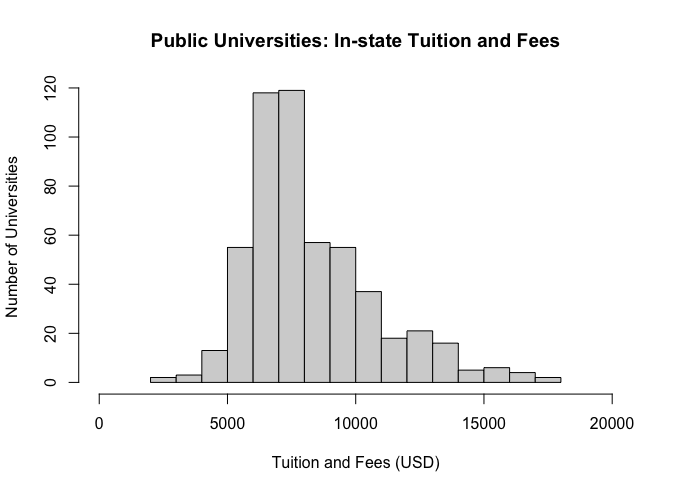
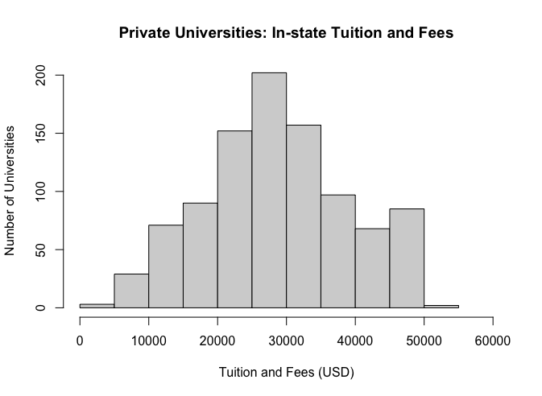

Michael Uftring
Indiana University
V506 - Statistical Analysis, Summer 2018
Mid-term Exam

-----

# Part I: Short Answer Questions

**1.** *A company was studying the demographics of their customers. As part of the study, they collected the following variables: political party, marital status, credit rating (low, medium, high), annual income, and age. Label each variable as qualitative or quantitative, discrete or continuous, and nominal, ordinal, interval, or ratio.*

| Variable                          | Type         | Range      | Scale    |
| --------------------------------- | ------------ | ---------- | -------- |
| political party                   | qualitative  | discrete   | nominal  |
| marital status                    | qualitative  | discrete   | nominal  |
| credit rating (low, medium, high) | qualitative  | discrete   | ordinal  |
| annual income                     | quantitative | continuous | interval |
| age                               | quantitative | continuous | interval |

**2.** *When describing a variable, we often want to know its central tendency (i.e. mean, median, mode). What are the advantages and disadvantages of each of these measures? Under what circumstances would it be best to use each measure?*

We seek to know the central tendency of a variable in order to get a sense of what a typical, or expected, response might be from the population.

The mean tells us the average value of a variable from all observations in the sample. The mean is only applicable to quantitative variables. It is intended to tell us a typical value we might expect for the variable in the population. The mean is susceptible to outliers (values well outside the expected range). In the presence of outliers, the mean value can be skewed left or right (depending on where the outliers exist) and no longer represent a good indicator of the central tendency.

The median is the value in the exact middle of the rank ordered set of observations. Half of the values will fall below the median, and half of the values will fall above the median. The median is applicable to quantitative, and categorical ordinal scale variables. The median is good for telling us the true center value; it is not affected by outliers. The mean does not give us any indication of the distribution of values above and below it, so very differently shaped distributions can have the same median.

The mode is the value occurring most often in a sample. It is a count, and represnets the value present the most number of times in a sample. The mode is mostly applicable to nominal and ordinal scale categorical variables, but can also be applied to quantitative variables (where the meaning of counting values makes sense). The mode is good at indicating the popularity of a value (e.g., most frequent responses). The mode does not tell us where in the overall distribution of values it falls (low, middle, or high).

**3.** *A study by the National Park Service revealed that 50% of the vacationers going to the Rocky Mountain region visit Yellowstone Park, 40% visit the Grand Tetons, and 35% visit both. What is the probability that a vacationer will visit at least one of these magnificent attractions?*

Let A represent visiting Yellowstone Park, and B represent visiting the Grand Tetons, and both are distinct possible outcomes.

$$P(A) = 0.5$$
$$P(B) = 0.4$$
$$P(A or B) = P(A) + P(B) = 0.5 + 0.4 = 0.9$$

**4.** *Why is randomization/random assignment such an important tool to establish causality?*

Random selection from a population or random assignment of subjects into different treatment groups provides a certain level of confidence that the selection or groups are more likely to be representative of the overall population of interest. Because the groups are formed by a random selection/assignemnt, each group will likely contain the same balance of measured and unmeasured variables. Therefore, measuring the response on the variables of interest is free of any external or respondent/subject bias.

**5.** *Briefly describe (in your own words – that means no copying and pasting directly from lecture slides) how the following types of bias might influence data collected from a survey: a) selection bias, b) nonresponse bias, c) social desirability bias.*

**a)** Selection bias arises from convenience samples or volunteer samples. In these cases the selection of survey respondents is not random, and so there is reduced confidence that the sample is representative of the population of interest. When this happens the answers to survey questions will likely be representative of the survey conductor (convenience samples are likely friends or acquaintances) or people often in the area (concenience samples are in this case people who frequent the area where the survey is conducted). With volunteer samples the results will be biased toward people comfortable with taking surveys on the topic of interest.

**b)** Nonresponse bias means there are no answers to some questions on the survey from some respondents. This could arise from ambiguous questions which the respondent cannot understand, or questions the respondent deems sensitive or private and wishes not to answer. If there are too many missing responses in the sample for a question, then the responses that have been provided should not be considered for analysis.

**c)** With social desirability bias the answers to survey questions are skewed towards what the respondents think is a correct answer, or what is believed to be a popular/desirable answer. This introduces risk that the answers do not represent the true sentiment or beliefs of the respondents.

**6.** *What is the mean (expected value) for the random variable x in the following probability distribution)?*



| $x$ | $P(x)$ |
| --- | ------ |
| 10  |   .1   |
| 11  |   .25  |
| 12  |   .3   |
| 13  |   .25  |
| 14  |   .1   |

$$E(x) = \sum xP(x)$$
$$E(x) = (10 \times .1) + (11 \times .25) + (12 \times .3) + (13 \times .25) + (14 \times .1)$$
$$E(x) = 12$$

**7.** *For a normal distribution, what is the likelihood (expressed as a percentage) that a random variable is within plus or minus two standard deviations of the mean? What about three standard deviations?*

For a normal distribution, the likelihood that a random variable is within...
- plus or minus two standard deviations of the mean? 95%
- plus or minus three standard deviations of the mean? 99.7%

**8.** *In a management trainee program, 80% of the trainees are female, while 20% are male. Ninety percent of the females attended college; 78% of the males attended college. A management trainee is selected at random. What is the probability that the person selected is a female who attended college?*

Let A represent that a trainee is female.
Let B represent female that attended college.

$$P(A) = 0.8$$
$$P(B) = 0.9$$
$$P(A \: and \: B) = P(A) \times P(B)$$
$$P(female \: who \: attended \: college) = 0.72$$

**9.** *In a large metropolitan area, past records revealed that 30% of all the high school graduates go to college. From 20 graduates selected at random, what is the probability that exactly 8 will go to college?*

This is a case where we want to apply the Probability for a Binomial Distribution, because: (1) there are two possible outcomes for each observation, (2) using the historical values, the probability is the same for each observation, (3) the outcomes for each observation are independent.

$x$ = the number of outcomes
$n$ = the number of independent observations
$P(x)$ = the probability that $x$ outcomes will fall into a single category
$\pi$ = the probability that any one outcome will fall into a single category
$1-\pi$ = the probability that any one outcome will fall into the other category

$$P(x) = \frac{n!}{x!(n-x)!}\pi^{x}(1-\pi)^{n-x}$$

In this problem,
$n$ = 20
$x$ = 8
$\pi$ = 0.30

$P(8) = \frac{20!}{8!(20-8)!}0.3^{8}(1.0-0.3)^{20-8}$
$=\frac{20!}{8!(12)!}0.3^{8}(0.7)^{12}$
$=0.114$

Under these conditions, approximately 11.4% will got to college.

**10.** *What is the area under the normal curve between z = -1.0 and z = -2.0? What about between z=1.0 and z=3.0? What about z=-1.0 and z=3.0?*

Given that we know: the total area under the normal curve is 1.0, the area between -3.0 and 3.0 is 0.997, between -2.0 and 2.0 is 0.95, and the area between -1.0 and 1.0 is 0.68; we can calculate the following based on the portions and differences between the known points.

- between z = -1.0 and z = -2.0? 0.135
- between z = 1.0 and z = 3.0? 0.1585
- between z = -1.0 and z = 3.0? 0.8385

**11.** *The mean score of a college entrance test is 500; the population standard deviation is 75. The scores are normally distributed. What percent of the students scored below 320?*

To find the percent of students scoring below 320, we must compute the z-score. The z-score indicates the number of standard deviations that 320 is away from the mean of 500. Looking up the z-score in Table A will reveal the percentage value of interest.

$$z = \frac{y - \mu}{\sigma}$$
$$z = \frac{320 - 500}{75} = \frac{-180}{75}= -2.4$$

We will take the absolute value of this computed z-score as Table A only has positive values. The normal distribution is symmetric, so the positive and negative z-scores represent identical probabilities or percentages. The sign of the z-score reflects how far above $y$ is from the mean (positive z-score), or how far below $y$ is from the mean (negative z-score).

Consulting Table A, $z = 2.4 \rightarrow 0.0082$, so 0.82% of the students scored below 320.

**12.** *The Office of Student Services at a large state university maintains information on the study habits of its full-time students. Suppose we select a random sample of 35 current students and find a sample mean of 21.5 hours spent studying per week, with a sample standard deviation of 5.6 hours. Based on this survey data, test the claim that the average number of hours students spend studying per week is greater than 18 (use the 0.05 level of significance).*

The null hypothesis claim is that the average number of hours students spend studying per week is equal to 18. The alternative hypothesis is that the average number of hours students spend studying per week is greater than 18.
$H_{0}: \mu = 18$
$H_{a}: \mu > 18$

We will compute standard error and use this to find the t-score.
$n = 35$
$\bar{y} = 21.5$
$s = 5.6$
$\mu_{0} = 18$

$$se = \frac{s}{\sqrt{n}} = \frac{5.6}{\sqrt{35}} = 0.947$$
$$t = \frac{\bar{y} - \mu_{0}}{se} = \frac{21.5 - 18}{0.947} = 3.696$$

The degrees of freedom is $df = n - 1 = 35 - 1 = 34$. With a 0.05 level of significance we expect a t-score with $df = 34$ to be around 1.697; looking at the nearest $df$ row of 30 in Table B. Finding the t-score value of 3.696 in that same row of Table B indicates single-tail probability of 0.001. With the large t-score of 3.696 and the p-value 0.001 which is much less than the 0.05 significance level, the evidence against the null hypothesis is substantial. We can therefore reject the null hypotheses and accept the alternative hypothesis, and conclude that the average number of hours students spend studying per week is greater than 18.

**13.** *A total of 500 voters are randomly selected and asked whether they plan to vote for the Democratic incumbent or the Republican challenger in an upcoming statewide election. Of the 500 surveyed, 350 said they would vote for the Democratic incumbent. Using the 0.95 confidence level, what are the confidence limits for the proportion that plan to vote for the Democratic incumbent?*

$n = 500$
$\hat{\pi} = 350 / 500 = 0.7$

$$se = \sqrt{\frac{\hat{\pi}(1 - \hat{\pi})}{n}} = \sqrt{\frac{0.7(1 - 0.7)}{500}} = 0.02$$

Using the 0.95 confidence level, we lookup the single-tail probability of 0.025 in Table A to find the z-score of 1.96. So, the confidence interval is:
$$\hat{\pi} \pm 1.96(se) = 0.7 \pm 1.96(0.020) = 0.7 \pm 0.0392$$

This yields confidence limits: (0.6608, 0.7392).

**14.** *Suppose that the Monroe County school district has proposed a small sales tax increase to help cover costs associated with the construction of a new middle school. The tax will only go into effect if a majority (more than 50%) of voters approve the increase during an upcoming vote. The local newspaper conducted a poll drawn from a random sample of Monroe County voters, and found that 320 out of 600 respondents indicated that they supported the new tax. The school district superintendent wants to know whether the new sales tax will pass, and has tasked you with analyzing the survey results.*

**a)** *Derive and test the appropriate hypotheses which will answer the superintendent’s question.  Use the p-value method, with α=0.05. Briefly (2-3 sentences) interpret the results.*

$H_{0}: \pi = 0.5$, the proportion of voters in support is 50%
$H_{a}: \pi > 0.5$, the proportion of voters in support is greater than 50%

$z = \frac{\hat{\pi} - \pi_{0}}{se_{0}}$
$se_{0} = \sqrt{\pi_{0}(1-\pi{0})/n}$

$z$ is the test statistic
$\hat{\pi}$ is the estimate of the parameter
$\pi_{0}$ is the null hypotheses value of the parameter
$se_{0}$ is the standard error of the estimator

$n = 600$
$\hat{\pi} = 320/600 = 0.53$
$\pi_{0} = 0.5$

$se_{0} = \sqrt{0.5(1-0.5)/600} = 0.02$

$z = \frac{0.53 - 0.5}{???} = 1.67$

For a z-score of 1.67, the P-score is 0.0475. This is a one-sided test as we are trying to determine if more than 50% of voters will support the tax increase. With a P-score of 0.0475 and $\alpha$ = 0.05, we can conclude that there is likely sufficient support for the proposed tax increase to pass, but there is not overwhelming support for it.

**b)** *When you present your results to the superintendent, she asks how much confidence you place in the estimate for the proportion of voters supporting the initiative.  To answer this question, construct a confidence interval for the proportion of voters in favor of the new tax, using α = .05.  Briefly interpret the results.*

The confidence interval is $\hat{\pi} \pm z(se)$, where:
$\hat{\pi}$ is the estimate of the parameter
$z$ is the z-score, or test statistic, and
$se$ is the sample estimate of a standard Error

$se = \sqrt{\frac{\hat{\pi}(1-\hat{\pi})}{n}} = 0.02$
$\hat{\pi} \pm z(se) = 0.533 \pm 1.67(0.020) = 0.533 \pm 0.0334$

The confidence interval is therefore (0.4999, 0.5667), meaning that the proportion of support for the tax increase is between 49.99% and 56.67%. While not an absolute certainty, with the low-end of the confidence interval is at 1/100th of a percent below, and the vast majority of the confidence interval range is above the tipping point of 50%, we can conclude that there is a very good certainty that the voters will vote in favor of the tax increase and the measure will pass.

**15.** *Suppose that you are a TA for wonderful, amazing, incredibly smart statistics professor. This professor has asked you to determine if former SPEA V506 have the same mean income after graduation compared to former students who took stats in a different department at IU. To answer this question, you randomly sample 20 former V506 students and ask them to report their annual income. Using this sample data, you determine that the average income for former SPEA V506 students is \$68,456, with a sample standard deviation of \$9,568. Next, you compile a random sample of 25 former students who took statistics in a different department at IU. The mean annual income within this sample is \$60,350, with a sample standard deviation of \$9,378. You may assume that the population standard deviation for former V506 students is equal to that for former students who took stats in other departments.*

*Assuming a normal distribution for both of these populations, derive and test the appropriate hypotheses that will allow you to answer your statistics professor’s question. Use α = 0.01. Briefly (2-3 sentences) interpret your results.*

| Group | Sample Size | Annual Income mean | Annual Income  standard deviation |
| --- | --- | --- | --- |
| V506 students   | 20  | \$68,456  | \$9,568  |
| others   | 25  | \$60,350  | \$9,378  |

**Testing the hypotheses**

> determine if former SPEA V506 have the same mean income after graduation compared to former students who took stats in a different department at IU

- group 1 will be former V506 students
- group 2 will be students who took stats in a different department at IU

$H_{0}: \mu_{1} = \mu_{2}$
$H_{a}: \mu_{1} \ne \mu_{2}$

$se = \sqrt{(\frac{s_{1}^{2}}{n_{1}}) + (\frac{s_{2}^{2}}{n_{2}})}$
$ = \sqrt{(\frac{9568^{2}}{20}) + (\frac{9378^{2}}{25})}$
$ = 2845.208$

$t = \frac{\bar{y_{2}} - \bar{y_{1}} - 0}{se}$
$ = \frac{60350 - 68456}{2845.208}$
$ = -2.849$

> the mechanism for computing $df$ is complex, ... $df$ generally falls somewhere between $(n_{1} + n_{2} - 2)$ and the minimum of $(n_{1} - 1)$ and $(n_{2} - 1)$

$(n_{1} + n_{2} - 2) = 20 + 25 - 2 = 43$
$(n_{1} - 1) = (20 - 1) = 19$
$(n_{2} - 1) = (25 - 1) = 24$

So, $df$ is somewhere between 19 and 43.

Consulting Table B for $\alpha = 0.01$, we find that the t-score when $df = 19$ to be 2.861. The absolute value of our computed t-score is 2.849 which is slightly less than that value, so we are within tolerance at the low-end of the possible degrees of freedom range. As our actual t-score is negative, it indicates that group 2 has a lower value than group 1. Given these results we can conclude with 99% confidence that after graduation V506 students have a higher mean income than students who took statistics in another IU department.

# Part II: R Programming Questions

The following questions require that you download the “university_data.csv” file from canvas and import this file into R. This dataset contains information on the amount charged for in-state tuition and fees (intuitfees) in the 2014-2015 school year, along with variables indicating the name of the institution (instnm), state (stateabbr) and whether the institution is a public or private university (sector). Note that not every institution in the country is included in this dataset (some institutions had missing data or did not respond to the survey). Please be sure to include both your code and the relevant output in your answers.

> This dataset has four fields:
> - `instnm` : the name of the institution
> - `stateabbr` : state (abbreviated)
> - `intuitfees` : amount charged for in-state tuition and fees
> - `sector` : whether the institution is a public or private university

**1.** *Calculate the following descriptive statistics for the in-state tuition and fees variable for the entire dataset: a) mean, b) standard deviation, c) number of observations, d) standard error of the mean.*

| Variable | Mean | Standard Deviation | Number of Observations | Standard Error of the Mean|
| --- | --- | --- | --- | --- |
| `intuitfees`   | 21403.28  | 12937.61  | 1487  | 335.5046  |

**2.** *Now calculate those same descriptive statistics, but disaggregated by sector (i.e. compute the mean, standard deviation, number of observations, and standard error of the mean separately for public institutions and for private institutions).*

| Sector Variable | Mean | Standard Deviation | Number of Observations | Standard Error of the Mean|
| --- | --- | --- | --- | --- |
| Public `intuitfees`   |  8265.54  | 2520.57   | 531   | 109.3835   |
| Private `intuitfees`   | 28700.50   | 10375.40   | 956   | 335.5644   |

**3.** *Construct histograms for in-state tuition and fees for both public and private universities (i.e. make two histograms, one for each sector). In constructing these histograms, change the color of the bars to be grey, and be sure to label both the X and Y axis. Add a title to each histogram to identify which group of universities it is describing.*

**4.** *Because public universities receive state subsidies to help offset costs, they are generally thought to charge less in tuition and fees than their private counterparts.*

**a)** *Conduct a hypothesis test, at the 0.05 significance level, to evaluate this hypothesis (that public universities have lower in-state tuition and fees than private institutions).*
**\*\*\*Note this is NOT a single sample test. You should treat public and private institutions as separate samples, and thus should do a two-sample test).** Briefly interpret the results.

**Testing the hypotheses**

> public universities have lower in-state tuition and fees than private institutions

- group 1 will be public institutions
- group 2 will be private institutions

$H_{0}: \mu_{1} = \mu_{2}$
$H_{a}: \mu_{1} \lt \mu_{2}$

$se = \sqrt{(\frac{s_{1}^{2}}{n_{1}}) + (\frac{s_{2}^{2}}{n_{2}})} = 352.942$

$t = \frac{\bar{y_{2}} - \bar{y_{1}} - 0}{se} = 57.899$

The t-score is huge, and positive, which means the P-value is effectively zero. This indicates that the null hypothesis is absolutely rejected and the alternate hypothesis must be accepted. We can therefore conclude with absolute certainty that public universities have lower in-state tuition and fees than private institutions.

**b)** *Next, construct a 95% confidence interval around the estimated* **difference** *in tuition and fees between the two groups (hint: remember that confidence intervals are never one-tailed). Briefly interpret the results.*

**Confidence interval**

$se = \sqrt{(\frac{s_{1}^{2}}{n_{1}}) + (\frac{s_{2}^{2}}{n_{2}})}$

The confidence interval is defined as:
$(\bar{y_{2}} - \bar{y_{1}}) \pm t(se)$

With large sample sizes, so the t-score for the margin of error is essentially the z-score; at the 95% confidence interval we then have:
$ = (28700.5 - 8265.54) \pm 1.96(352.942)$
$ = 20434.96 \pm 691.76632$, or
$(19743.19, 21126.73)$

Both values in the confidence interval are positive, which indicates that $\mu_{2} - \mu_{1}$ is positive (private tuition and fees minus public tuition and fees will produce a positive value), and means the $\mu_{2}$ is larger than $\mu_{1}$. We can conclude with 95% confidence that private in-state tuition and fees are between \$19,743.19 and \$21,126.73 greater than public in-state tuition and fees.
